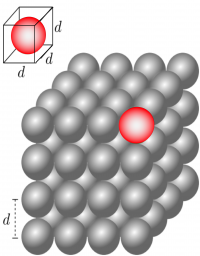

To understand how solids exert different forces, you must learn how the microscopic, ball and spring model relates to more macroscopic measures such as elongation/compression and force. To do this, we will need to model the interatomic bond between two atoms in a cubic lattice a spring. **In these notes, you will read about the relationship between microscopic physical quantities and macroscopic ones as they relate to the extension or compression of solid materials.**

## Lecture Video



## Modeling the interatomic bond as spring

Cubical lattice model of solid where the interatomic distance is $d$.

To model the interatomic bond as a spring, we will need to first determine how “long” the bond is. Let's take the concrete example of Platinum (Pt). A single mole of Pt has $6.02 \times 10^{23}$ atoms in it and has an atomic mass of $195.08g$. Pt has a density of $21.45g/cm^{3}$. We can determine the density of Pt in SI units:

$$
\rho = 21.45\frac{g}{cm^{3}}\left( \frac{1kg}{10^{3}g} \right)\left( \frac{100cm}{1m} \right)^{3} = 21.45 \times 10^{3}kg/m^{3}
$$

Consider a cubic meter of Pt, which is a cube that is 1m long on each side[1)](/notes/week-06-solids-curved-motion/model_of_a_wire/#fn__1). You can use this to find the number of Pt atoms in a cubic meter:

$$
21.45 \times 10^{3}\frac{kg}{m^{3}}\left( \frac{1mol}{0.195kg} \right)\left( \frac{6.02 \times 10^{23}atoms}{1mol} \right) = 6.62 \times 10^{28}\ atoms
$$

If our 1 cubic meter is actually a cube then we can find the number of atoms along any edge:

$$
Atoms\ on\ an\ edge = \sqrt[3]{6.62 \times 10^{28}\ atoms} = 4.04 \times 10^{9}\ atoms/edge
$$

If the atoms are all lined up on a single edge, and we approximate their rough spherical shape by cubes with the same length as the atomic diameter (Figure to right), we can find the size of atoms along a 1m edge:

$$
d = \frac{1m}{4.04 \times 10^{9}\ atoms/edge} = 2.47 \times 10^{- 10}m
$$

This is roughly the distance between atoms in a solid piece of Pt. We think of this as the “interatomic bond length.” For most metals, this is betw
