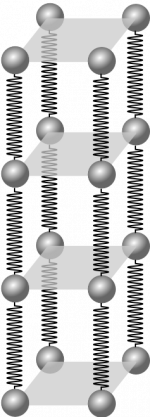
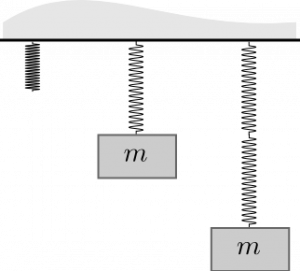
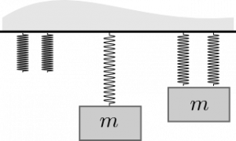

To understand how solids exert different forces, you must learn how the microscopic, ball and spring model relates to more macroscopic measures such as elongation/compression and force. To do this, we will need to model the interatomic bond between two atoms in a cubic lattice a spring. **In these notes, you will read about the relationship between microscopic physical quantities and macroscopic ones as they relate to the extension or compression of solid materials.**

### Lecture Video



### Modeling the interatomic bond as spring

Cubical lattice model of solid where the interatomic distance is $d$.

To model the interatomic bond as a spring, we will need to first determine how “long” the bond is. Let's take the concrete example of Platinum (Pt). A single mole of Pt has $6.02 \times 10^{23}$ atoms in it and has an atomic mass of $195.08g$. Pt has a density of $21.45g/cm^{3}$. We can determine the density of Pt in SI units:

$$
\rho = 21.45\frac{g}{cm^{3}}\left( \frac{1kg}{10^{3}g} \right)\left( \frac{100cm}{1m} \right)^{3} = 21.45 \times 10^{3}kg/m^{3}
$$

Consider a cubic meter of Pt, which is a cube that is 1m long on each side[1)](/notes/week-06-solids-curved-motion/model_of_a_wire/#fn__1). You can use this to find the number of Pt atoms in a cubic meter:

$$
21.45 \times 10^{3}\frac{kg}{m^{3}}\left( \frac{1mol}{0.195kg} \right)\left( \frac{6.02 \times 10^{23}atoms}{1mol} \right) = 6.62 \times 10^{28}\ atoms
$$

If our 1 cubic meter is actually a cube then we can find the number of atoms along any edge:

$$
Atoms\ on\ an\ edge = \sqrt[3]{6.62 \times 10^{28}\ atoms} = 4.04 \times 10^{9}\ atoms/edge
$$

If the atoms are all lined up on a single edge, and we approximate their rough spherical shape by cubes with the same length as the atomic diameter (Figure to right), we can find the size of atoms along a 1m edge:

$$
d = \frac{1m}{4.04 \times 10^{9}\ atoms/edge} = 2.47 \times 10^{- 10}m
$$

This is roughly the distance between atoms in a solid piece of Pt. We think of this as the “interatomic bond length.” For most metals, this is between .1-.2 nm as you calculated above.

# Modeling the solid wire

Model of wire, which uses parallel chains of springs.

The simplest model we can use for a wire (beyond a single atomic chain), is to model it as many long parallel chains connected by springs. For you to understand this model, you will need to understand how to model two springs connected end-to-end (in series) and two springs connected side-by-side (in parallel).

## Two springs connected end-to-end (series)

Two springs connected end-to-end.

Let's consider attaching a 100N ball to a single 100N/m spring. If we let the weight just hang motionless (no change in momentum), we know from the [momentum principle](/notes/week-02-modeling-motion-net-force/momentum_principle/) that the net force on the ball is zero. Hence,

$$
\Delta\overset{\rightarrow}{p} = 0\ \ \ implies\ \ \ {\overset{\rightarrow}{F}}_{net} = {\overset{\rightarrow}{F}}_{grav} + {\overset{\rightarrow}{F}}_{spring} = 0
$$

$$
{\overset{\rightarrow}{F}}_{grav} + {\overset{\rightarrow}{F}}_{spring} = \langle 0, - mg\rangle + \langle 0,k_{s}s\rangle = 0
$$

$$
s = \frac{mg}{k} = \frac{100N}{100N/m} = 1m
$$

Hence, a single 100 N/m spring will stretch precisely 1m when a 100N ball is hung from it.

When we attach a second 100N/m spring to the end of the first and then attach the mass, both springs will stretch 1m. That is, the overall stretch of the spring-mass system is 2m.

*In series, each spring stretches as if the mass were attached to just that spring*, and the sum of all those stretches gives the overall stretch.

### Modeling two end-to-end springs as one spring (effective spring constant)

You will often find it useful to consider a whole chain of springs as one spring. That is, you can model springs attached end-to-end as one hypothetical spring that stretches the same amount under the same load as the chain of springs. This is called using an effective spring constant. It's *effective* in the sense that it models the *effect* of having this chain of springs not that it is in any sense more efficient. For the example above, you can find the single spring that stretches 2m when a 100N ball is attached to it.

$$
\Delta\overset{\rightarrow}{p} = 0\ \ \ implies\ \ \ {\overset{\rightarrow}{F}}_{net} = {\overset{\rightarrow}{F}}_{grav} + {\overset{\rightarrow}{F}}_{eff,spring} = 0
$$

$$
{\overset{\rightarrow}{F}}_{grav} + {\overset{\rightarrow}{F}}_{eff,spring} = \langle 0, - mg\rangle + \langle 0,k_{s,eff}s\rangle = 0
$$

$$
k_{s,eff} = \frac{mg}{s} = \frac{100N}{2m} = 50N/m
$$

Evidently, two springs with the same spring constant in series can be modeled by a single (floppier) spring with half the spring constant of the each of the two springs. We can add springs in series to find the effective spring constant using this reciprocal formula where the reciprocal of each spring constant for each spring in the chain is added together (and then inverted).

$$
\frac{1}{k_{s,eff}} = \sum_{i}^{}\frac{1}{k_{i}} = \frac{1}{k_{1}} + \frac{1}{k_{2}} + \frac{1}{k_{3}} + \ldots
$$

For example, in our case,

$$
\frac{1}{k_{s,eff}} = \sum_{i}^{}\frac{1}{k_{i}} = \frac{1}{100N/m} + \frac{1}{100N/m} = \frac{2}{100N/m} = \frac{1}{50N/m}
$$

$$
k_{s,eff} = 50N/m
$$

## Two springs side-by-side (parallel)

Let's consider attaching a 100N ball to two 100N/m springs where each spring is connected to the ball and not to each other. In this case, both springs must stretch by the same amount. If the ball hangs motionless (no change in momentum), we can use the momentum principle to determine how much these springs stretch.

Two springs connected side-by-side.

$$
\Delta\overset{\rightarrow}{p} = 0\ \ \ implies\ \ \ {\overset{\rightarrow}{F}}_{net} = {\overset{\rightarrow}{F}}_{grav} + {\overset{\rightarrow}{F}}_{spring,1} + {\overset{\rightarrow}{F}}_{spring,2} = 0
$$

$$
{\overset{\rightarrow}{F}}_{grav} + {\overset{\rightarrow}{F}}_{spring,1} + {\overset{\rightarrow}{F}}_{spring,2} = \langle 0, - mg\rangle + \langle 0,k_{s}s\rangle + \langle 0,k_{s}s\rangle = \langle 0, - mg\rangle + 2\langle 0,k_{s}s\rangle = 0
$$

$$
s = \frac{mg}{2k} = \frac{100N}{200N/m} = 0.5m
$$

When we attach a second 100N/m spring to the ball, the springs both stretch 0.5m. That is, the overall stretch of the spring-mass system is half of what it is with one spring.

*In parallel, each spring stretches the same amount*.

### Modeling two side-by-side springs as one spring (effective spring constant)

You will often find it useful to consider a bunch of side-by-side springs as one spring. Similar to what was done with springs in series, you can model side-by-side springs as one hypothetical spring that stretches the same amount under the same load as the side-by-side springs. For the example above, you can find the single spring that stretches 0.5m when a 100N ball is attached to it.

$$
\Delta\overset{\rightarrow}{p} = 0\ \ \ implies\ \ \ {\overset{\rightarrow}{F}}_{net} = {\overset{\rightarrow}{F}}_{grav} + {\overset{\rightarrow}{F}}_{eff,spring} = 0
$$

$$
{\overset{\rightarrow}{F}}_{grav} + {\overset{\rightarrow}{F}}_{eff,spring} = \langle 0, - mg\rangle + \langle 0,k_{s,eff}s\rangle = 0
$$

$$
k_{s,eff} = \frac{mg}{s} = \frac{100N}{0.5m} = 200N/m
$$

Evidently, two springs with the same spring constant in parallel can be modeled by a single (stiffer) spring with twice the spring constant of the each of the two springs. We can add springs in parallel to find the effective spring constant using this formula.

$$
k_{s,eff} = \sum_{i}^{}k_{i} = k_{1} + k_{2} + k_{3} + \ldots
$$

For example, in our case,

$$
k_{s,eff} = \sum_{i}^{}k_{i} = 100N/m + 100N/m = 200N/m
$$

This way of modeling end-to-end and side-by-side springs will be very useful for modeling [the compression and extension of real materials](/notes/week-06-solids-curved-motion/youngs_modulus/).

------------------------------------------------------------------------

[1)](/notes/week-06-solids-curved-motion/model_of_a_wire/#fnt__1)

This amount of Pt would costs nearly \$700,000,000.
