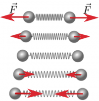
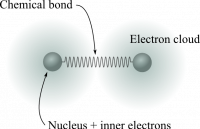
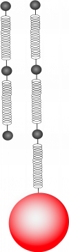

Until now, you have read (primarily) about forces that result from the gravitational interaction in both its [exact](/notes/week-03-newtonian-gravitation/gravitation/) and [approximate](/notes/week-02-modeling-motion-net-force/localg/) forms. The exception thus far has been the [spring force](/notes/week-04-05-springs-contact-interactions/springmotion/), which, until now, you took as just another of likely many possible forces. As it turns out *the main types of force that you are concerned about in mechanics are the gravitational force and the electric force.* In fact, the spring force is the result of electrical interactions in matter. As you will read, all contact forces (like the spring force) result from the compression or extension of solid materials, which are themselves compressions or extensions of the bonds between atoms in the material (electrical interactions). **In these notes, you read about how we model these compressions and extensions, and how those interactions give rise to another contact force – tension.**

## Lecture Video



## The Ball-Spring Model of Matter

All matter is made up of atoms, which (as you know) are in turn made up of a dense positively charge nucleus (with a $\sim 1 \times 10^{- 15}m$ radius) and a sparse, negatively charged electron cloud (with a $\sim 1 \times 10^{- 10}m$ radius). The interaction between atoms is due primarily to the charges in the atoms. We observe that when two atoms are near each other, the long range electrical forces cause them to attract, but only up to a point. When atoms are pushed too close together, they begin to repel each other.

Extending or compressing the ends of ball-spring system.

These observations are not unlike those we observe with two ends of a spring (Figure to the right). Pulling the ends apart (past the springs relaxed length) stretches the spring, which results in a force by the spring “inward” to restore it to its relaxed length. Pushing the ends together (past the relaxed length) compresses the spring, which results in a force by the spring “outward” to restore it to its relaxed length.

A good model for the interaction between to atoms.

The bond between atoms shares the same qualitative characteristics. Up to a point, it also shares the same quantitative characteristics. That is, a good model for the interaction between two atoms is two balls, which represent the dense nuclear core surrounded by the inner electrons, and spring between them, which represents the chemical bond due to the shared outer electrons (Figure to the left).

From [scanning tunneling microscopy (STM)](http://en.wikipedia.org/wiki/Scanning_tunneling_microscope) and [atomic force microscopy (AFM)](http://en.wikipedia.org/wiki/Atomic_force_microscopy), we know that many solid materials are arranged in regularly spaced arrays. For example, here's a [picture rendered from using an STM on graphite](http://upload.wikimedia.org/wikipedia/commons/7/76/Graphite_ambient_STM.jpg). These arrays exist in three dimensions and are often called a “lattice.” Atoms in these lattices are constantly in motion. The simplest such lattice is a cubic lattice, which is shown in the image below.

Using the ball and springs to model the physical characteristics of solids might seem artificial for a number of reasons including that atoms do not have well defined radii. Moreover, it is typically the case that solid materials are made of multiple elements, which implies that the “balls” on each end of a “spring” would be different sizes and the “springs” joining these different balls would have different spring constants. However, you can get quite far modeling solids with this model. **In fact, you can predict the compression and extension of macroscopic objects as well as explain friction using this model quite well.** So while it might seem artificial, it is a productive and useful model.

## Tension

Free body diagram for the ball

Take a wire made of a single metal, say platinum, and hang a heavy ball from it. If the wire doesn't snap under the weight of the ball, the ball will hang motionless. Let's apply the [momentum principle](/notes/week-02-modeling-motion-net-force/momentum_principle/) to the system consisting of just the ball. In this case, the ball is motionless (for any $\Delta t$), hence:

$$
\Delta\overset{\rightarrow}{p} = \langle 0,0,0\rangle = {\overset{\rightarrow}{F}}_{net}\Delta t\ \ \ implies\ \ \ {\overset{\rightarrow}{F}}_{net} = \langle 0,0,0\rangle
$$

### Free-body diagram

You can draw a [free-body diagram](http://en.wikipedia.org/wiki/Free_body_diagram) for this situation. A free body diagram shows the direction and magnitude of the forces acting on any system. In this case, the Earth and the wire act on the ball in opposite directions. Because the net force on the ball is zero, the size of the force due to the Earth and the force due to the wire must be the same.

### Size of the tension force

Using the momentum principle and supported by the free-body diagram, you can conclude that the sum of the forces acting on the ball ([the net force](/notes/week-02-modeling-motion-net-force/momentum_principle/#net_force)) is simply the vector sum of the gravitational force and the force due to the wire. This determines the force due to the wire, or the “tension in the wire.”

$$
{\overset{\rightarrow}{F}}_{Earth} + {\overset{\rightarrow}{F}}_{wire} = {\overset{\rightarrow}{F}}_{net} = \langle 0,0,0\rangle
$$

$$
{\overset{\rightarrow}{F}}_{wire} = - {\overset{\rightarrow}{F}}_{Earth} = - \langle 0, - m_{ball}\ g,0\rangle = \langle 0,m_{ball}\ g,0\rangle
$$

So, the tension force is equal to the weight of the ball. This might be the first “statics” problem that you have solved. In engineering, [statics is a branch of study](http://en.wikipedia.org/wiki/Statics) that focuses on structures that do not move. Part of that analysis is ensuring that the system doesn't translate (i.e., that the sum of all the forces acting on a static system is zero). The second part, [as you will learn](/notes/week-12-14-collisions-rotational-motion/l_principle/), is that the system doesn't rotate.

## Modeling tension microscopically

Each bond extends the same amount.

Consider a very thin wire that is one atom thick. In this case, you can observe what happens to each bond in the wire when a heavy ball is attached to the end of the wire (Figure to the left). **In this case, each bond is “stretched” by roughly the same amount. This is the model to consider when you think “the tension is the same throughout the wire.”**

In a real material, the upper bonds stretch the most because they support the ball attached to the end along with all the atoms below that bond. The lower bonds stretch the least because they have fewer atoms below them to support. Atoms have mass, and each atom is supporting the weight below itself including the attached ball.

The model that we have proposed (where each bond stretches equal amounts) requires that the atoms have no mass; this leads to the “massless” wire assumption that is often used in physics problems. But, this model still helps us understand how the microscopic interactions give rise to our macroscopic observations. What you can see now, is that there is a limit to the weight a given wire can handle; it will stretch until bonds break and wire is broken.
