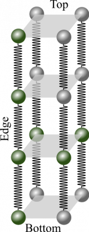
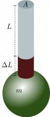
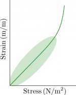

Earlier, you read how to [add springs in parallel and in series](/notes/week-06-solids-curved-motion/model_of_a_wire/). **In these notes, you will read about how the microscopic measurements of bond length and interatomic spring stiffness relate to macroscopic measures like [Young's modulus](http://en.wikipedia.org/wiki/Young's_modulus).** We will continue using Platinum wire as our example.

## Hanging a mass from a platinum wire

Consider a 2m long platinum wire ($L = 2m$) with a square cross section. That is, the wire is not “round” when viewed on end, but square. This wire is 1mm thick ($S = 1mm$); each side of the wire is 1mm. If you were to hang a 10kg weight, this 2m wire stretches by 1.166 mm ($s = 1.166mm$).

### Determining the interatomic "spring stiffness"

If you model the whole wire as a single spring, you can find the spring stiffness of the whole wire. From the [momentum principle](/notes/week-02-modeling-motion-net-force/momentum_principle/) (momentum not changing), you can determine the this stiffness because the net force is zero.

$$
{\overset{\rightarrow}{F}}_{net} = {\overset{\rightarrow}{F}}_{grav} + {\overset{\rightarrow}{F}}_{wire} = 0
$$

$$
{\overset{\rightarrow}{F}}_{wire} = - {\overset{\rightarrow}{F}}_{grav} = \langle 0,k_{s,wire}s\rangle = - \langle 0, - mg\rangle
$$

$$
k_{s,wire} = \frac{mg}{s} = \frac{(10kg)(9.81m/s^{2})}{0.001166m} = 8.41 \times 10^{4}N/m
$$

This is very large spring constant because the wire (taken as a whole) is very stiff. *Note: the units of N/m for k.*

### Finding the number bonds in the wire

Using the model of a cubic lattice, you can determine the number of bonds in the wire and the number of bonds in a single chain.

To find the interatomic spring stiffness, you will need to know how many chains of atoms are in the wire (how many side-by-side springs) and how many atoms are in the chain (how many end-to-end springs). Those values can be found by using the bond “length”, [which you read about earlier](/notes/week-06-solids-curved-motion/model_of_a_wire/#modeling_the_interatomic_bond_as_spring). To remind you, the estimated bond length for Platinum is $d = 2.47 \times 10^{- 10}m$.

The number of chains in a square wire ($N_{s}$) is estimated by dividing the overall cross-sectional area of the wire ($S^{2}$) by the “area” of the bond ($d^{2}$).

$$
N_{chains\ in\ wire} = \frac{A_{wire}}{A_{bond}} = \frac{S^{2}}{d^{2}} = \left( \frac{0.001m}{2.47 \times 10^{- 10}m} \right)^{2} = 1.64 \times 10^{13}\ chains
$$

The number of chains is equal to the number of side-by-side springs ($N_{s}$) in this model.

The number of bonds in a single chain can be found by dividing the length of the wire ($L$) by the bond length ($d$).

$$
N_{bonds\ in\ chain} = \frac{L_{wire}}{L_{bond}} = \frac{L}{d} = \frac{2m}{2.47 \times 10^{- 10}m} = 8.10 \times 10^{9}\ bonds
$$

##### Finding the interatomic spring stiffness

Because in our model all the bonds are assumed to be the same, the interatomic spring stiffness ($k_{s,interatomic}$) is determined by adding the springs [as you have read before](/notes/week-06-solids-curved-motion/model_of_a_wire/). The details of that addition are below, but the final result is that the interatomic spring stiffness is related to the spring stiffness of the wire like so:

$$
k_{s,interatomic} = \frac{N_{bonds\ in\ chain}}{N_{chains\ in\ wire}}k_{s,wire} = \frac{8.10 \times 10^{9}}{1.64 \times 10^{13}}8.41 \times 10^{4}\ N/m = 41.52\ N/m
$$

The details for this calculation are below.

$$
k_{s,side - by - side} = \sum_{chains}^{}k_{s,interatomic} = N_{chains\ in\ wire}k_{s,interatomic}
$$

$$
\frac{1}{k_{s,wire}} = \sum_{along\ chains}^{}\frac{1}{k_{s,side - by - side}} = \frac{N_{bonds\ in\ chain}}{k_{s,side - by - side}} = \frac{N_{bonds\ in\ chain}}{N_{chains\ in\ wire}k_{s,interatomic}}
$$

$$
k_{s,wire} = \frac{N_{chains\ in\ wire}}{N_{bonds\ in\ chain}}k_{s,interatomic}
$$

$$
k_{s,interatomic} = \frac{N_{bonds\ in\ chain}}{N_{chains\ in\ wire}}k_{s,wire}
$$

The value that we found for the interatomic spring stiffness of Platinum (41.52 N/m) is typical of most pure metals, which have a range from about 5 to about 50 N/m.

## Young's Modulus

Like density, the interatomic spring stiffness ($k_{s,interatomic}$) is an [intensive property](http://en.wikipedia.org/wiki/Intensive_and_extensive_properties#Intensive_properties) of an object, it doesn't depend on the length or shape of the object. Other properties are [extensive](http://en.wikipedia.org/wiki/Intensive_and_extensive_properties#Extensive_properties) such as mass, volume, and the spring stiffness of the whole wire ($k_{s,wire}$). Scientists and engineers will often work with intensive properties because they characterize the material and not the object. However, the interatomic spring stiffness is not a property that scientists and engineers often use. When discussing the compression and extension of materials, they often use the bulk modulus or [Young's modulus](https://en.wikipedia.org/wiki/Young%27s_modulus).

### Stress and strain

Hanging a mass $m$ on the end of a wire with relaxed length $L$ and cross-sectional area $A$ results in an elongation (stretch) $\Delta L$.

To understand Young's modulus, you must learn about stress and strain.

As you will use it, *stress is a measure of the tension (or compression) in a material per unit area*. If a force of $F_{T}$ is applied to the end of a bar or wire of cross-sectional area $A$, then the stress is given by:

$$
stress = \frac{F_{T}}{A}
$$

The *strain is a measure of the fractional stretching (or compressing) of a material*. If a material of relaxed length $L$ stretches or is compressed by a distance $\Delta L$ along that length, then the strain is given by:

$$
strain = \frac{\Delta L}{L}
$$

Young's Modulus ($Y$) is the ratio of the stress to the strain and is measured in $N/m^{2}$, which is a special unit called “Pascals (Pa)”[1)](/notes/week-06-solids-curved-motion/youngs_modulus/#fn__1).

$$
Y = \frac{F_{T}/A}{\Delta L/L}
$$

Young's modulus is an intensive quantity; it doesn't depend on the size (length, area, volume) of the material (you “divide that out”). Notice that the definition of Young's modulus is quite similar to that for spring force; Young's modulus relates a force (per unit area) to a stretch (per unit length):

$$
\frac{F_{T}}{A} = Y\frac{\Delta L}{L} \rightarrow F = k_{s}s
$$

Here, the Young's modulus ($Y$) takes the role of the spring constant ($k_{s}$); a stiff material will have a large $Y$ and a floppy material will have a smaller $Y$.

##### The elastic regime

In the elastic regime, the material will return to its relaxed length after the load is removed.

For many uses, the force per unit area is linearly proportional to the elongation of the material per unit length (as the above equation suggests). This regime is called the “elastic regime” and is where the material will return to its relaxed length after the load is removed.

However, there is a point (the elastic limit) after which the material will not fully return to the its relaxed length. At this point the material begins to “yield” and stretches much more easily with less force needed. This is the “elastic limit” where our linear model above will no longer apply.

### Connecting the microscopic and the macroscopic

Because the Young's modulus is an intensive quantity, it applies to our model at any scale. So we can apply the Young's modulus equation to a pair of atoms sharing a single bond of length $d$ (the $d$ is both the relaxed length and the scale of the atoms). If the atomic bond (with interatomic spring stiffness $k_{s,interatomic}$) stretches a small amount $s$, then the Young's modulus for that pair of atoms is given by:

$$
Y = \frac{F_{T}/A}{\Delta L/L} = \frac{(k_{s,interatomic}s)/d^{2}}{s/d} = \frac{k_{s,interatomic}}{d}
$$

Here, you have connected a macroscopic measurement ($Y$) to a microscopic model ($\frac{k_{s,interatomic}}{d}$).

### Examples

- [Video Example: Chains and Bonds of a Copper Wire](/examples/videoswk4/)

------------------------------------------------------------------------

[1)](/notes/week-06-solids-curved-motion/youngs_modulus/#fnt__1)

This is the same SI unit that is used for pressure.
