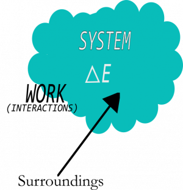

*“It is important to realize that in physics today, we have no knowledge what energy is. We do not have a picture that energy comes in little blobs of a definite amount. It is not that way.”*

*“Energy is a numerical quantity, which does not change when something happens….”*

The above quotes come from [Richard Feynmann](http://en.wikipedia.org/wiki/Richard_Feynman), a 20th century physicist who is thought to have some of the greatest insights into the physical world. He's being a bit flippant about our knowledge of energy, but he's not wrong. We don't know what energy is. We know that energy is a conserved quantity. That is, you can track the energy of a system and see that it changes forms, but it is not created or destroyed. **In this set of notes, you will read a brief bit about the history of different energy ideas, about the different forms of energy, and the first law of thermodynamics (conservation of energy).**

## Lecture Video



## Scientists and scholars have struggled to define energy

The greek philosopher [Aristotle](http://en.wikipedia.org/wiki/Aristotle) is often attributed with the first discussion of energy, but not in its modern form. Aristotle, like many philosophers of his time, were concerned with connecting the physical world to the human experience. Aristotle's and others' of the time “scientific” arguments were not grounded in science as we know it now, but more natural philosophy. That is, a well-spoke argument could go a long way even if it had little scientific evidence to back it up. Aristotle's concept of energy (*energeia*) was more like the idea of work. But it applied not only to physical systems, but to other natural systems as well, including human emotion. Two examples of energy applied to human emotion in Aristotle's work are *pleasure* and *happiness*. Pleasure is the energy of the human body while happiness is the energy of the human being human.

In the 17th century, [Isaac Newton](http://en.wikipedia.org/wiki/Isaac_Newton) and [Gottfried Leibniz](http://en.wikipedia.org/wiki/Gottfried_Wilhelm_Leibniz) provided our first understanding of the modern concept of energy. They built off of the great work of mathematicians like [Archimedes](http://en.wikipedia.org/wiki/Archimedes) and physicists like [Galileo Galilei](http://en.wikipedia.org/wiki/Galileo_Galilei) to build the calculus, which solidified the idea of [conservation of momentum](/notes/week-04-05-springs-contact-interactions/collisions/) (or [the momentum principle](/notes/week-02-modeling-motion-net-force/momentum_principle/)). At this time, conservation of momentum was the leading theory that could explain many of the experiments that Newton, Leibniz, and others were conducting. However in a number of the experiments that Lebniz conducted he found that the sum of the mass times the speeds squared ($\sum m_{i}v_{i}^{2}$ = constant) was a conserved quantity. He called this the [vis viva](http://en.wikipedia.org/wiki/Vis_viva) (*living force*). However this quantity could not be understood using conservation of momentum ($\sum m_{i}{\overset{\rightarrow}{v}}_{i}$ = constant). For many years, there was much debate about the vis viva and how it modeled the physical world. By the middle of the 19th century, the puzzle was resolved by two French engineers, [Gaspard-Gustave Coriolis](http://en.wikipedia.org/wiki/Gaspard-Gustave_Coriolis) and [Jean-Victor Poncelet](http://en.wikipedia.org/wiki/Jean-Victor_Poncelet), who built on the great work in thermodynamics by 18th and 19th century engineers.

## Energy takes different forms

While energy is difficult to define absolutely, it takes a number of different forms.

**Kinetic energy** is the energy associated with the motion of systems, which can be individual objects or collections of objects. **Thermal energy** can be thought of as a microscopic form of kinetic energy.

**Potential energy** arises from the interactions between pairs of objects. These are manifest in gravitational interactions (gravitational potential energy) and electrostatic interactions (electrostatic, elastic, and chemical potential energy).

There are two other forms of energy that you might be aware of: **radiant energy** associated with light, and the **mass energy** associated with objects that have mass.

While there are many forms of energy, almost all forms of energy used by us can be traced back to the sun. Think about the energy flow that occurs use a hand crank flashlight.

Sun $\rightarrow$ grass $\rightarrow$ chicken = food chemical PE $\rightarrow$ chemical PE in muscles $\rightarrow$ crank (kinetic energy) $\rightarrow$ electric light.

## The First Law of Thermodynamics (The Energy Principle)

The first law of thermodynamics (or the energy principle) governs when energy moves into and out of systems. In other words, ***the work that is done is equal to the energy that is transferred or transformed.*** For this to make sense, you have to define a system and track how the energy of that system ($E_{sys}$) changes as a result of work done by the surroundings ($W_{surr}$) and the heat exchanged with the surroundings ($Q$). Mathematically, you can write this relationship as the energy principle,

$$
\Delta E_{sys} = W_{surr} + Q
$$

This principle tells you precisely how the energy of the system will change as a result of interactions with the surroundings.
