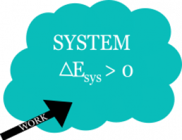
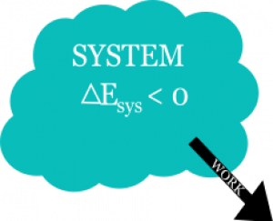
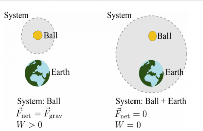

The observational fact that the energy of a system and its surroundings does not change has become [a principle that underlies all of physics](https://en.wikipedia.org/wiki/Conservation_of_energy). When we look at a system, we can count up all the energy at different times and determine how energy is moving between the system and its surroundings. This help us to be able to predict and explain the motion of objects. **In these notes, you will read about how a system changes its energy when there is no exchange of thermal energy with the surroundings.** You will also read about how to approach situations where more than one object might be in your system.

## Lecture Video



## The Total Energy of a System Can Change

When work is done *by* the surroundings on the system, the total energy of the system increases. Energy from the surroundings is being “dumped” into the system.

When the system does work *on* the surroundings, the total system energy decreases. Energy from the system is being extracted.

***We observe that the total change in energy of a system and the system surroundings is zero.*** This means that whatever energy change we observe in the system, is exactly taken up by the surroundings. That is, if the system energy goes down, then the energy of the surroundings must go up.

$$
\Delta E_{sys} + \Delta E_{surr} = 0
$$

$$
\Delta E_{sys} = - \Delta E_{surr}
$$

$$
\Delta E_{sys} = W_{surr}
$$

This energy change of the surroundings is the work that is either done **by** or **on** the surroundings. These prepositions are incredibly important to distinguish whether the energy of the system has increased or decreased. The figures to the right provide a conceptual illustration.

In the case where work is done *by* the surroundings, the total energy of the system will increase. In this case, the work done by the surroundings is positive because the energy of the surroundings will decrease ($W_{surr} > 0 \rightarrow \Delta E_{surr} < 0$).

In the case where work is done *on* the surroundings, the total energy of the system will decrease. In this case, the work done by the surroundings is negative because the energy of the surroundings will increase ($W_{surr} < 0 \rightarrow \Delta E_{surr} > 0$).

You must be particularly careful with the language when talking about energy as the prepositions *on* and *by* are often used in different ways and knowing whether you are talking about the work done *by* the surroundings or *on* the surroundings is a key distinction to make.

## Defining systems

In your work with the [energy principle](/notes/week-07-energy-transfer/define_energy/), it is critical that the system be defined. Defining a system is not sleight of hand or a clever accounting trick, it's a fundamental aspect of predicting and explaining motion. The systems that you have defined thus far have been single-particle systems, but now you will learn to work with multi-particle systems. Which particles are chosen as part of the system often dictates what predictions can be made and what motion can be explained?

In applying energy conservation to different systems, it can be challenging to keep track of all the important elements. You will need to be systematic, and the following 3 steps will help:

1.  What's the system? Determine what you are going to put into the system. What objects do you want to predict or explain the motion of?
2.  What are the initial and final states? Energy conservation lends itself to a discussion of what happened before and after an interactions. For energy conservation, the details of the motion aren't captured, what matters is state of the system before and after the interactions.
3.  Calculate. After you have chosen your system, and determined its initial and final states, then you apply the [energy principle](/notes/week-07-energy-transfer/define_energy/) (and start to calculate).

## Multi-particle Systems

Two cases of a ball falling from rest with different choices of system.

Consider a ball initially at rest that begins to fall towards the Earth.

In the first case, you choose the ball to be the system. The kinetic energy of the ball increases because the work that is done by the gravitational force due to Earth (which is in the surroundings) does positive work on the ball. The displacement of the ball is down and so is the gravitational force.

For case 1 with the ball as the system,

1.  System: Ball; Surroundings: Earth
2.  Initial state: Ball at rest; Final state: Ball moving
3.  $\Delta K_{ball} > 0$ because $W_{surr} > 0$ ($\Delta K_{ball} = W_{surr})$

In the second case, you choose the ball and the Earth to be the system. The kinetic energy of the ball still increases, but now there's no external forces due to the surroundings and hence no external work because the Earth is included in the system.

For case 1 with the ball as the system,

1.  System: Ball + Earth; Surroundings: Nothing
2.  Initial state: Ball at rest; Final state: Ball moving
3.  $\Delta K_{ball} > 0$ but why? $W_{surr} = 0$

This puzzle will be resolved by considering energy associated with the interactions of particles within a multi-particle system. This [potential energy](/notes/week-07-energy-transfer/potential_energy/) is associated with how the different objects are configured with respect to each other and what their interactions are.
