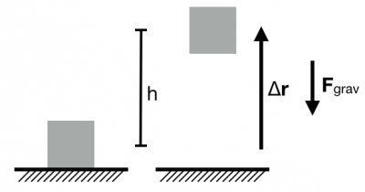
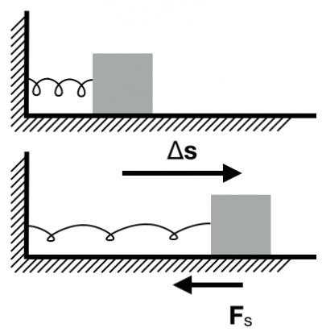

[Potential energy](/notes/week-07-energy-transfer/potential_energy/) is the energy associated with interactions between pairs of objects. **In these notes, you will read about two particular types of potential energy: the energy associated with the gravitational interaction and the energy associated with a spring-mass system.**

## (Near Earth) Gravitational Potential Energy

An object (mass, $m$) is lifted above the surface of the Earth (height, $h$).

To determine the (near Earth) gravitational potential energy associated with a system consisting of an object and the Earth, consider the work done by the Earth on the object (mass, $m$) that is being lifted to height $h$ above the surface of the Earth. The displacement and the gravitational force are in opposite directions.

To calculate the work that the Earth does, consider the object as the system.

1.  System: object; Surroundings: Earth
2.  Initial state: object at $y_{i} = 0$; Final state: object at $y_{f} = h$

$$
W_{grav} = {\overset{\rightarrow}{F}}_{grav} \cdot \Delta\overset{\rightarrow}{r} = - mg(y_{f} - y_{i}) = - mgh
$$

So more generally, the work done by the local gravitational force is,

$$
W_{grav} = - mg(y_{f} - y_{i})
$$

If you include the Earth in your system, so that the system is now the Earth and the object, then potential energy shared between the Earth and the object is given by,

1.  System: object+Earth; Surroundings: Nothing
2.  Initial state: object at $y_{i} = 0$; Final state: object at $y_{f} = h$

$$
\Delta U_{grav} = - W_{grav} = + mg(y_{f} - y_{i})
$$

The (near Earth) gravitational potential energy depends on the mass of the object ($m$) and how separation between the Earth and the object change ($y_{f} - y_{i}$).

## Spring Potential Energy

A spring-mass system (spring constant, $k_{s}$) is stretched through a distance ($\Delta s$).

To determine the potential energy associated with a spring-mass system, consider the work done by a spring on an object (mass, $m$) attached to its end. The spring is stretched through a displacement ($\Delta\overset{\rightarrow}{s}$). The displacement and the spring force are in opposite directions.

To calculate the work that the spring does, consider the object as the system. Remember that the [spring force changes with displacement](/notes/week-04-05-springs-contact-interactions/springmotion/), and thus we must use the [integral formulation to calculate the work](/notes/week-07-energy-transfer/work_by_nc_forces/).

1.  System: object; Surroundings: spring
2.  Initial state: object at $s_{i} = 0$; Final state: object at $s_{f} = s$

$$
W_{s} = \int_{0}^{s}{\overset{\rightarrow}{F}}_{spring} \cdot d\overset{\rightarrow}{r}
$$

$$
W_{s} = \int_{0}^{s}\left( - k_{s}x \right)dx = - k_{s}\int_{0}^{s}x\mspace{6mu} dx = - k_{s}x^{2}|_{0}^{s} = - \frac{1}{2}k_{s}s^{2}
$$

So more generally, the work done by a spring is given by,

$$
W_{s} = - \frac{1}{2}k_{s}\left( s_{f}^{2} - s_{i}^{2} \right)
$$

If you include the spring in your system, so that the system is now the spring and the object, then the potential energy shared between the spring-object system is given by,

1.  System: object+spring; Surroundings: Nothing
2.  Initial state: object at $s_{i} = 0$; Final state: object at $s_{f} = s$

$$
\Delta U_{s} = - W_{s} = + \frac{1}{2}k_{s}\left( s_{f}^{2} - s_{i}^{2} \right)
$$

The spring potential energy depends on the spring constant ($k_{s}$) and how stretch changes ($s_{f} - s_{i}$).

## Conservative Forces

Both of the examples above (local gravitational force and spring force) are examples of [conservative forces](http://en.wikipedia.org/wiki/Conservative_force). Conservative forces are those for which we can associate a potential energy. The energy associated with conservative forces does not depend on the path that the objects take but only their separation. That is, for conservative forces, only the initial and final locations of the objects matter not the path they took to get from one place to another. Forces that only depend on position tend to be conservative.[1)](/notes/week-07-energy-transfer/grav_and_spring_pe/#fn__1)

Dissipative forces such as friction and air drag are non-conservative forces. The path that an object takes matters very much when non-conservative forces are present. Moreover, these dissipative forces cannot be associated with any construct like potential energy.

## Examples

- [Sledding down a hill](https://www.msuperl.org/wikis/pcubed/doku.php?id=183_notes:examples:sledding)
- [The Jumper](https://www.msuperl.org/wikis/pcubed/doku.php?id=183_notes:examples:the_jumper)

------------------------------------------------------------------------

[1)](/notes/week-07-energy-transfer/grav_and_spring_pe/#fnt__1)

We say “tend to” because there is an additional condition that the force have [no curl](http://en.wikipedia.org/wiki/Curl_(mathematics)).
