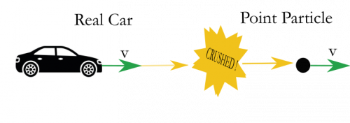

The [energy principle](/notes/week-07-energy-transfer/define_energy/#the_first_law_of_thermodynamics_the_energy_principle) is widely applicable and helps to explain or to predict the motion of systems by considering how the system exchanges energy with its surroundings. For now, you will read about the simplest of systems, that of a single particle. **In these notes, you will read about the total energy of a particle, the energy due to its motion, and how those energies are connected in situations where we can neglect the [heat exchanges](/notes/week-10-internal-energy-heat/heat/)**.

## Lecture Video



## The Total Energy of a Single Particle

A real car crushed down to a point particle for the purpose of modeling the translation of the car.

The systems that you will consider will be approximated by a single object, ***the point particle***. The point particle is an object that has no size of its own, but carries the mass of the object it is meant to represent. This point particle experiences the same force that the real object experiences, and thus models the motion of that real physical system to the extent that you only care about how the object translates (moves without rotation). Point particles do not spin or change their shape. Later, [we will relax these conditions](/notes/week-11-multi-particle-energy/energy_sep/).

Thanks to Einstein, we know the total energy of a single particle system is given by,

$$
E_{tot} = \gamma mc^{2}
$$

where $m$ is the mass of the particle, $c$ is the speed of light in vacuum (3$\times 10^{8}$ m/s), and $\gamma$ is the [correction due to relativity](/notes/week-02-modeling-motion-net-force/momentum/#when_does_the_gamma_factor_matter) when the particle is moving near the speed of light. If a system of one particle is at rest ($v = 0$) then,

$$
E_{tot} = \gamma mc^{2} = \frac{1}{\sqrt{1 - (v^{2}/c^{2})}}mc^{2} = \frac{1}{\sqrt{1 - (0^{2}/c^{2})}}mc^{2} = mc^{2}
$$

Evidently, a particle at rest has a total energy that is simply associated with its mass. This is called the [*rest mass energy*](http://en.wikipedia.org/wiki/Mass%E2%80%93energy_equivalence) of that particle and really matters when particles change their identity (e.g., in chemical or nuclear reactions).

$$
E_{rest} = mc^{2}
$$

It appears that the rest of the energy is associated with the motion of the particle. As such, it is refereed to as the ***kinetic energy (J)*** of the particle.

$$
K = E_{tot} - E_{rest} = \gamma mc^{2} - mc^{2} = (\gamma - 1)mc^{2}
$$

This is probably not the form of the kinetic energy that you are used to seeing. This is because for most purposes, objects are moving slowly enough where the relativistic correction doesn't matter. At low speeds,

$$
K = (\gamma - 1)mc^{2} = \left( \frac{1}{\sqrt{1 - v^{2}/c^{2}}} - 1 \right)mc^{2} \approx \left( \left( 1 + \frac{1}{2}\frac{v^{2}}{c^{2}} \right) - 1 \right)mc^{2} = \frac{1}{2}\frac{v^{2}}{c^{2}}mc^{2} = \frac{1}{2}mv^{2}
$$

This definition of kinetic energy is due to Newton, but was confirmed by Coriolis and others. The total energy of a particle is thus the sum of its rest mass energy and its kinetic energy, which at low speeds is given by,

$$
E_{tot} = E_{rest} + K = mc^{2} + \frac{1}{2}mv^{2}
$$

For the time being you will neglect heat exchanges (although you will [later relax that assumption](/notes/week-10-internal-energy-heat/heat/)), so that the system of a single particle system changes its total energy as a result of work by the surroundings.

$$
\Delta E_{tot} = \Delta E_{rest} + \Delta K = W_{surr}
$$

If the particle does not change its identity, then there is no change in rest mass energy and you are left with,

$$
\Delta K = K_{f} - K_{i} = W_{surr}
$$

This is often called the “Work-Kinetic Energy Theorem”, but it's just a restricted version of the [energy principle](/notes/week-07-energy-transfer/define_energy/#the_first_law_of_thermodynamics_the_energy_principle).

## Work: Mechanical Energy Transfer

Let's consider the case where a particle doesn't change its identity, so the system simply changes its kinetic energy,

$$
\Delta K = W_{surr} = W
$$

where we can drop the subscript for “surroundings” knowing full well that the work is done by the interactions the system has with its surroundings.

Consider this analogy. From the momentum principle, the net force acting over some time results in a change in momentum,

$$
\Delta{\overset{\rightarrow}{p}}_{sys} = {\overset{\rightarrow}{F}}_{net}\Delta t
$$

This expression relates the net force and the time over which it acts to change in momentum, and thus, a change in velocity. Is there a quantity that is related to distance over which the net force acts?

$$
\Delta?? = (net\ force)*(distance)
$$

As it turns out, this thing is the energy of the system, or in this restricted case, the kinetic energy of the particle.

$$
\Delta K = W = Fd
$$

### Update form of the Energy Principle

You can rewrite the [energy principle](/notes/week-07-energy-transfer/define_energy/#the_first_law_of_thermodynamics_the_energy_principle) to predict the final kinetic energy if you know the initial kinetic energy and the work done by the surroundings.

$$
\Delta K = K_{f} - K_{i} = W
$$

$$
K_{f} = K_{i} + W
$$

This is the update form of the [energy principle](/notes/week-07-energy-transfer/define_energy/#the_first_law_of_thermodynamics_the_energy_principle) for a single particle that doesn't change its identity.
