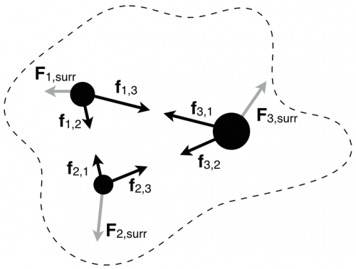
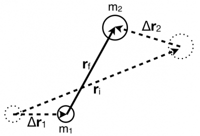

For multi-particles systems, you will have to keep track of the energy changes associated with the internal forces. That is, the work done by objects in the system on other objects in the system. As you will read, we can often associate an energy with pairs of interacting of objects, which we call “potential energy.” **In these notes, you will read about potential energy, how it keeps track of the energy associated with interactions internal to the system, and some of its properties.**

## Lecture Video



## What is potential energy?

***Potential energy (J)*** is energy associated with pairs of objects that interact with each other within a system. Because potential energy exists between pairs of objects, no single object can have potential energy, it is a multi-particle system that has potential energy. It's referred to as potential energy because it can be converted to other forms of energy. Common examples of systems with potential energy include stretched/compressed springs, galaxies of stars interacting gravitationally, atoms in which protons and electrons interact electrically, and TNT.

## Formal definition of Potential Energy

Consider a system of three particles (bounded by the dotted line) where each object interacts with the others and with the surroundings. In the figure to the right, the forces that are internal to the system are represented by black arrows and have lower-case letters (e.g., ${\overset{\rightarrow}{f}}_{1,2}$ is the force that object 1 experiences due to object 2). The grey arrows represent the net interactions that each particle has with the surroundings (e.g., ${\overset{\rightarrow}{F}}_{1,surr}$ is the force that object 1 experiences due to the surroundings).

Using this figure, you can determine the total energy change of each particle due the forces that act on that particle through their own displacements:

$$
\Delta E_{1} = \left( {\overset{\rightarrow}{f}}_{1,2} + {\overset{\rightarrow}{f}}_{1,3} \right) \cdot \Delta{\overset{\rightarrow}{r}}_{1} + {\overset{\rightarrow}{F}}_{1,surr} \cdot \Delta{\overset{\rightarrow}{r}}_{1}
$$

$$
\Delta E_{2} = \left( {\overset{\rightarrow}{f}}_{2,1} + {\overset{\rightarrow}{f}}_{2,3} \right) \cdot \Delta{\overset{\rightarrow}{r}}_{2} + {\overset{\rightarrow}{F}}_{2,surr} \cdot \Delta{\overset{\rightarrow}{r}}_{2}
$$

$$
\Delta E_{3} = \left( {\overset{\rightarrow}{f}}_{3,1} + {\overset{\rightarrow}{f}}_{3,2} \right) \cdot \Delta{\overset{\rightarrow}{r}}_{3} + {\overset{\rightarrow}{F}}_{3,surr} \cdot \Delta{\overset{\rightarrow}{r}}_{3}
$$

For the time being consider just object 1. The formulas above have been written somewhat suggestively to distinguish between interactions internal and external to the system. The work done on object 1 by forces internal to the system are:

$$
W_{1,int} = \left( {\overset{\rightarrow}{f}}_{1,2} + {\overset{\rightarrow}{f}}_{1,3} \right) \cdot \Delta{\overset{\rightarrow}{r}}_{1}
$$

The work done on object 1 by forces external to the system:

$$
W_{1,ext} = {\overset{\rightarrow}{F}}_{1,surr} \cdot \Delta{\overset{\rightarrow}{r}}_{1}
$$

You can add up all the energy changes to find the total energy change of the system:

$$
\Delta E_{1} + \Delta E_{2} + \Delta E_{3} = W_{int,TOT} + W_{surr,TOT}
$$

$$
\underset{everything\ in\ system}{\underbrace{\Delta E_{1} + \Delta E_{2} + \Delta E_{3} - W_{int,TOT}}} = \underset{everything\ outside\ system}{\underbrace{W_{surr,TOT}}}
$$

The change in potential energy of a multi-particle system is equal to the negative of the internal work done by the system. This definition is represented mathematically,

$$
\Delta U = - W_{int,TOT}
$$

Each of pair of objects has a potential energy term that quantifies the interaction between those two objects. For example, the potential energy shared by objects 1 and 2 above would be represented like this $U_{1,2}$.

## Energy in a multi-particle system

The total energy of a multi-particle system where you have neglected the thermal energy of the objects in the system is given by the sum of the individual kinetic energies of the objects and potential energy between each pair of objects,

$$
E_{sys} = \left( K_{1} + K_{2} + K_{3} + \ldots \right) + \left( U_{1,2} + U_{1,3} + U_{2,3} + \ldots \right)
$$

When you work with multi-particle systems, it's important to choose your system and be consistent in your choice of system and how you are working with the energy of that system.

Do not double count the energy. An object in the system does not do external work but it can (with another object) share potential energy.

## Lecture Video



## Potential Energy Depends on Separation NOT Location

