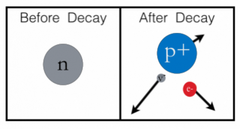

Until now, you have dealt with particles that do not change their identity. Changing the identity of a particle occurs when a [particle decays to another particle](http://en.wikipedia.org/wiki/Nuclear_fission) (or, typically, set of particles), or when [two or more particles fuse together](http://en.wikipedia.org/wiki/Nuclear_fusion). **In these notes, you will read about a new unit of energy (the [electron volt](http://en.wikipedia.org/wiki/Electronvolt)) and how to use energy to predict or explain particle decay.**

## The Electron Volt

For many situations, the unit of the Joule is quite useful. For very small particles like neutrons, protons, and electrons, a different unit is used typically. Consider the rest mass energy for the neutron,

$$
E_{rest} = mc^{2} = (1.6749 \times 10^{- 27}kg)(3 \times 10^{8}m/s)^{2} = 1.51 \times 10^{- 10}J
$$

This energy is quite small, so folks often convert this to the electron volt which is,

$$
1eV = 1.6 \times 10^{- 19}J
$$

The electron volt is just another unit of energy. It can be used to scale the rest mass energy of the neutron.

$$
E_{rest} = 1.51 \times 10^{- 10}J\frac{1eV}{1.6 \times 10^{- 19}J} = 9.396 \times 10^{8}eV = 939.6MeV
$$

Typically, elementary particle rest mass energies are given in “mega-electron volts” (MeV, $10^{6}$ eV). Below is a table of a few elementary particles and their rest mass energies.

| Particle            | Rest Mass Energy (MeV) |
|---------------------|------------------------|
| Neutrino, $\nu$   | $\approx$ 0 MeV      |
| Electron, $e^{-}$ | 0.511 MeV              |
| Proton, $p^{+}$   | 938.8 MeV              |
| Neutron, $n$      | 939.6 MeV              |

## Example: Neutron Decay

A neutron will spontaneously decay into a proton, electron, and an anti-neutrino.

As an example of the change of particle identity, consider [decay of a neutron](http://en.wikipedia.org/wiki/Neutron#Free_neutron_decay) where a neutron spontaneously decays into a proton, an electron, and an [anti-neutrino](http://en.wikipedia.org/wiki/Neutrino). A neutron is at rest and spontaneously decays, let's determine the kinetic energy available for the decay products after the decay.

The system before the decay consists of just the neutron. After the decay, let's choose the system to be the proton, electron, and anti-neutrino. If that's what we choose for the system, there's no work done by the surroundings because there's nothing in the surroundings.

1.  System: neutron (before decay); proton, electron, and anti-neutrino (after decay)
2.  Surroundings: nothing much

So you can apply the [energy principle](/notes/week-07-energy-transfer/define_energy/) to this problem to find the sum of all the kinetic energies.

$$
E_{sys,f} = E_{sys,i} + W
$$

The system energies consist of the sum of the rest mass energies and the kinetic energies of the particles.

$$
(m_{p}c^{2} + K_{p}) + (m_{e}c^{2} + K_{e}) + K_{\overline{\nu}} = (m_{n}c^{2} + K_{n}) + W
$$

$$
(m_{p}c^{2} + K_{p}) + (m_{e}c^{2} + K_{e}) + K_{\overline{\nu}} = (m_{n}c^{2} + 0) + 0
$$

$$
(m_{p}c^{2} + m_{e}c^{2}) + K_{p} + K_{e} + K_{\overline{\nu}} = m_{n}c^{2}
$$

$$
(m_{p}c^{2} + m_{e}c^{2}) + (K_{p} + K_{e} + K_{\overline{\nu}}) = m_{n}c^{2}
$$

$$
K_{p} + K_{e} + K_{\overline{\nu}} = m_{n}c^{2} - (m_{p}c^{2} + m_{e}c^{2})
$$

$$
K_{p} + K_{e} + K_{\overline{\nu}} = 939.6MeV - (938.3MeV + 0.511MeV)
$$

$$
K_{p} + K_{e} + K_{\overline{\nu}} = 0.8MeV
$$

This energy is available to the products for their motion. This decay must also [conserve momentum](/notes/week-04-05-springs-contact-interactions/collisions/), so the decay products cannot all move in the same direction after the decay. There is no external force acting on the neutron during the decay, so that the change in momentum of the system must be zero.
