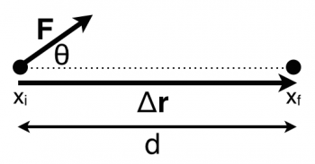
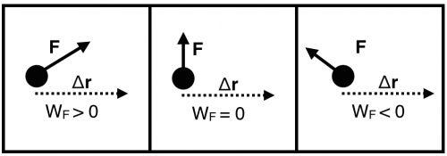

As you read earlier, [the change in the total energy of a system is equal to the work done on that system by its surroundings](/notes/week-07-energy-transfer/point_particle/). **In these notes, you will read about the formal definition of work, which is the transfer of mechanical energy, and a mathematical idea that underpins work - the dot product.**

## Lecture Video



## The Formal Definition of Work

The work that is done by a force is the ***scalar product*** (or dot product) of that force and the displacement.

$$
W = \overset{\rightarrow}{F} \cdot \Delta\overset{\rightarrow}{r} = F_{x}dx + F_{y}dy + F_{z}dz
$$

The dot product is one way that two vectors are “multiplied.” It is the sum of the product of each pair of components. This dot product is related to the angle that the force makes with the displacement. Essentially, the dot product will “pick out” the component of one vector that is parallel to another vector.

A point particle moves through a distance $d$ while a force $F$ is applied at an angle $\theta$ relative to the displacement.

Consider a point particle that moves through a displacement $\Delta\overset{\rightarrow}{r}$ while it experiences a force $\overset{\rightarrow}{F}$ at an angle $\theta$ relative to the displacement. The work that done on the particle by this force is,

$$
W = \overset{\rightarrow}{F} \cdot \Delta\overset{\rightarrow}{r} = F_{x}\Delta x + F_{y}\Delta y + F_{z}\Delta z = F\cos\theta\Delta r = F\cos\theta d
$$

where the last step considers that the only non-zero part of the dot product is the x bit. That is, the displacement is in the x-direction ($\Delta r$ = d), and the component of the force in that direction is $F\cos\theta$. In general, the work calculation picks out the piece of the force that is parallel to the displacement – that interaction is what increases the energy of the system.

$$
W = \overset{\rightarrow}{F} \cdot \Delta\overset{\rightarrow}{r} = F_{\parallel}\Delta r
$$

The units of work can be determined by the product of the units of its constituent bits.

$$
Work = (Force)*(distance) = (Newtons)*(meters) = Nm = Joule
$$

The units of work is a Joule named after [James Joule](https://en.wikipedia.org/wiki/James_Prescott_Joule), an English physicist and beer brewer. One Joule is equal to 1 $Nm$ or 1 $kgm^{2}/s^{2}$.

## Work can be positive, negative, or zero

The sign of the work done by a force is determined by the relative direction of the force and the displacement through which the force acts.

The work can increase or decrease the kinetic energy depending on the direction of the force. Consider three situations:

1.  A fan cart where the fan acts in the direction of motion (e.g., the cart starts from rest and speeds up)
2.  A fan cart where the fan acts opposite the direction of motion (here you only watch the fan cart until it is momentarily at rest).
3.  A fan cart where the fan acts perpendicular to the direction of motion (e.g., a fan mounted to push “down” on the car).

In case 1, the force is in the direction of motion, hence the car will speed up and increase its kinetic energy,

$$
W_{1} = {\overset{\rightarrow}{F}}_{1} \cdot \Delta{\overset{\rightarrow}{r}}_{1} = \Delta K_{1} > 0
$$

Evidently, when the force has a component in the direction of motion, the work done by the force is positive; it increases the kinetic energy of the system.

In case 2, the force is opposite the direction of motion, hence the car will slow down and decrease its kinetic energy,

$$
W_{2} = {\overset{\rightarrow}{F}}_{2} \cdot \Delta{\overset{\rightarrow}{r}}_{2} = \Delta K_{2} < 0
$$

When the force has a component opposite the direction of motion, the work done by the force is negative; it decreases the kinetic energy of the system.

In case 3, the force is perpendicular to the direction of motion, hence the cart will neither slow down or speed up. It will experience an increased vertical force due to the track (by [additional compression of the bonds in the track](/notes/week-04-05-springs-contact-interactions/friction/)). This doesn't change the kinetic energy of the cart.

$$
W_{3} = {\overset{\rightarrow}{F}}_{3} \cdot \Delta{\overset{\rightarrow}{r}}_{3} = \Delta K_{3} = 0
$$

When using work, it is critical to pay attention to the relative direction of the force and the displacement to determine how the kinetic energy will change (if at all).

## Lecture Video



## Graphing the Work Done: Force vs Displacement Graphs

The work that is done by a single force (or the net force) can be represented graphically in a force vs displacement graph. This is similar to the [force vs time graphs](/notes/week-04-05-springs-contact-interactions/impulsegraphs/) that you read about earlier where the area under the was the change in the momentum. In those graphs, you were limited to talking about the motion along a single direction. You would need three graphs to represent the momentum change in each direction.

In force vs displacement graphs, the limitations are more strict. Because the work done (green area under the curve below) is a result of a dot product between two vectors, we lose information about the direction of the forces and displacement when we compute it. So, these graphs are useful to think about the force in a particular direction and a displacement in that or opposite that direction.

For example, in the figure below, this might represent the net force acting on a cart in the x-direction. Sometimes, that force is in the direction of the displacement (positive work represented by the blue shaded area above the y=0 line). At other times that force is opposite the direction of the displacement (negative work represented by the red shaded area below the y=0 line).

Interactive simulation: Force vs Displacement — <https://msuperl.org/interactive/mechanics/net_force_vs_position_discrete.html>

## Work by the Local Gravitational Force

Consider an object (mass, $m$) that falls under the force of gravity through a distance ($\Delta y$). The force points down and the displacement points down, so the work is positive and the kinetic energy increases. Choosing the +$y$-axis to point up, you can calculate the change in kinetic energy of the particle. Using the [energy principle](/notes/week-07-energy-transfer/define_energy/#the_first_law_of_thermodynamics_the_energy_principle),

$$
\Delta K = W_{grav} = {\overset{\rightarrow}{F}}_{grav} \cdot \Delta\overset{\rightarrow}{r} = \langle 0, - mg\rangle \cdot \langle 0, - \Delta y\rangle = mg\Delta y
$$

Evidently, the work done by the local gravitational force is related to the vertical height change.

$$
W_{grav} = {\overset{\rightarrow}{F}}_{grav} \cdot \Delta\overset{\rightarrow}{r}\ \ which\ is\ typically\ \ W_{grav} = mg\Delta y
$$

What's very interesting about the work done by the local gravitational force is that it is [*conservative*](https://en.wikipedia.org/wiki/Conservative_force). The work done by the gravitational force does not depend on the path the object takes, only on the initial and final location of the object, which is how conservative forces are defined. In particular, it only depends on the change in the vertical position of the particle. That's all that matters for conservative forces – the end points.

## Examples

- [Video Example: Work and Friction + Ramp](/examples/videoswk7/)
