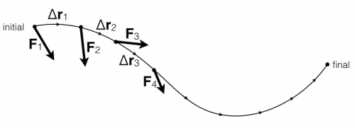

Until now, the [definition of work](/notes/week-07-energy-transfer/work/) that has been used is for forces that are constant vectors (constant in magnitude and direction). **In these notes, you will read about how to determine the work done by forces that change (either in their magnitude or direction).**

## Lecture Video



## Work done in small steps

A particle moves along a curved path where the force changes along the path. To estimate the work done by this force over the whole path, you can calculate the work done in small chunks and add them up.

Consider a particle that is moving along a curved path where the force changes at every instant in some way. The particle moves from an initial location to a final location, and you want to calculate the work acting on that particle over the entire path.

You could do this cutting up the path into little chunks and determining the work done in each chunk. The average force on the particle at that point in the path is ${\overset{\rightarrow}{F}}_{1}$. Over that small interval the work done in the first chunk is,

$$
W_{1} = {\overset{\rightarrow}{F}}_{1} \cdot \Delta{\overset{\rightarrow}{r}}_{1}
$$

Each chunk would contribute a small amount, so that the total work could be estimated by,

$$
W_{total} = W_{1} + W_{2} + W_{3} + \cdots = {\overset{\rightarrow}{F}}_{1} \cdot \Delta{\overset{\rightarrow}{r}}_{1} + {\overset{\rightarrow}{F}}_{2} \cdot \Delta{\overset{\rightarrow}{r}}_{2} + {\overset{\rightarrow}{F}}_{3} \cdot \Delta{\overset{\rightarrow}{r}}_{3} + \cdots = \sum_{i = l}^{N}{\overset{\rightarrow}{F}}_{i} \cdot \Delta{\overset{\rightarrow}{r}}_{i}
$$

## General Definition of Work done by a Force

If we make each chunk smaller (and thus have more chunks), the estimate would get better. In the limit that the chunks become infinitesimally small, the sum becomes an integral along the path.

$$
W_{total} = \int_{i}^{f}\overset{\rightarrow}{F} \cdot d\overset{\rightarrow}{r}
$$
