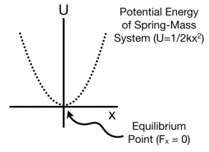
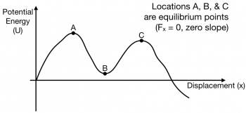
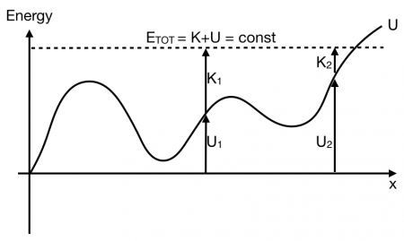

The [work done by a force is the integral of the force along the path](/notes/week-07-energy-transfer/work_by_nc_forces/) that the force acts. This definition of the work gives rise to a relationship between the potential energy due to the interaction between the objects and the force responsible for that interaction. **In these notes, you will read about the relationship between the force and the potential energy and how a graphical representation of the potential energy can also illustrate this force.**

### Lecture Video



### Force is the Negative Gradient of Potential Energy

As [you have read](/notes/week-07-energy-transfer/work_by_nc_forces/), the work (J) done by a force (N) is related to the integral along the path that the object takes. For forces where you can associate potential energy (J), this integral is also related to the change in potential energy.

$$
\Delta U = - W_{int} = - \int_{i}^{f}\overset{\rightarrow}{F} \cdot d\overset{\rightarrow}{r}
$$

***The potential energy is the negative line integral of the force.*** In one-dimension this can be written as follows,

$$
\Delta U = - \int_{x_{i}}^{x_{f}}F_{x}dx
$$

The above integral considers the change in potential energy over all path that takes the object from $x_{i}$ to $x_{f}$. The differential ($dx$) is really small. Consider a really small change in the potential energy ($dU$) that is the result of this really small displacement.

$$
dU = - F_{x}dx
$$

Physicists move these differentials around like numbers because they are small, but not infinitesimal like in the Calculus. So,

$$
dU = - F_{x}dx \rightarrow \frac{dU}{dx} = - F_{x}
$$

The force in the x-direction is the negative derivative of the potential energy,

$$
F_{x} = - \frac{dU}{dx}
$$

To find the force in three-dimensions, this derivative of the potential becomes the [gradient](http://en.wikipedia.org/wiki/Gradient) of the potential,

$$
\overset{\rightarrow}{F} = - \nabla U = \left\langle - \frac{dU}{dx}, - \frac{dU}{dy}, - \frac{dU}{dz} \right\rangle
$$

$$
\overset{\rightarrow}{F} = - \frac{dU}{dx}\widehat{x} - \frac{dU}{dy}\widehat{y} - \frac{dU}{dz}\widehat{z}
$$

## Equilibrium Points

That the force is the spatial derivative of the potential energy is a helpful way of thinking about equilibria – locations in space where the force acting on the particle is zero. Some equilibria are stable – if the particle is located at that point, it will stay near it even when given a small push. Some are unstable – given a small push, the particle will run away.

### Spring-Mass System

The potential energy of the spring-mass system is plotted as a function of the stretch in order to highlight the equilibrium points.

Consider the [potential energy of a spring-mass system](/notes/week-07-energy-transfer/grav_and_spring_pe/). Here, the potential energy is quadratic (bowl-shaped) function,

$$
U = \frac{1}{2}kx^{2}
$$

The force associated with that potential is the spring force,

$$
F_{x} = - \frac{dU}{dx} = - \frac{d}{dx}\left( \frac{1}{2}kx^{2} \right) = - kx
$$

The force is zero at $x = 0$. At that point, the slope of the potential energy graph is also zero. This point is stable because it is at the bottom of the “bowl-shaped” potential energy. Also, the force to the right side of the equilibrium point is pointing to the left ($F = - kx < 0$ because $x > 0$) and the force to the left side of the equilibrium point is pointing to the right ($F = - kx > 0$ because $x < 0$).

### More general potential energy diagrams

For this potential energy graph, the equilibria are marked.

In a more general potential energy diagram (to the right), you can determine the equilibrium points by finding where the slope is zero ($F_{x} = 0$). The stability of those points can be classified as stable or unstable.

A way to think about stability is to think of a bead sitting at the equilibiurm location. Is it stable against small pushes? For example, at location B, a small push on the bead would cause the bead to move up a bit, but it would come back – location B is stable. At location A and C, a bead given a small push would run away from those locations – both are unstable.

### Kinetic and Potential Energy in Potential Energy Graphs

From these potential energy graphs, you are able to determine the kinetic energy of the system at any location along the graph if you know the total energy of the system. In graph below, the total energy is indicated with a dotted line. The potential energy at any point is measured from the $U = 0$ line (e.g., $U_{1}$ and $U_{2}$). Because the total energy is the sum of kinetic and potential ($E_{tot} = K + U$), the kinetic energy is measured from the potential energy graph to the dotted line (e.g., $K_{1}$ and $K_{2}$).

From this diagram you can conclude that a particle with the given total energy will not make it past the location on the right where the dotted line crosses the solid line. It just doesn't have enough total energy (i.e., the kinetic energy goes to zero)!

