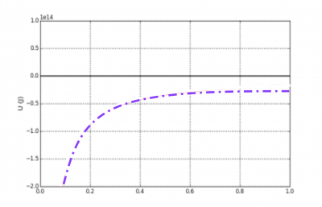
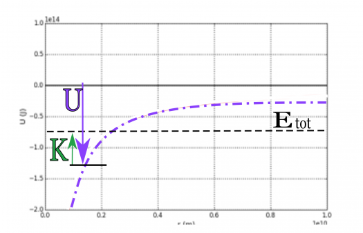
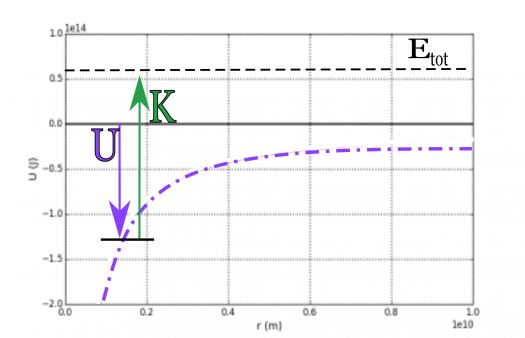
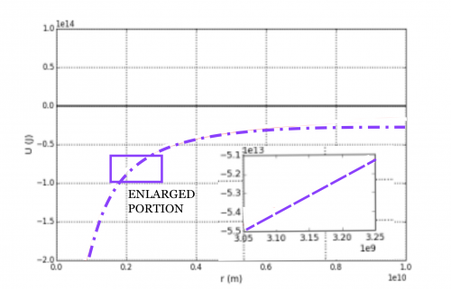
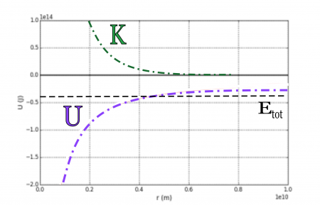

Knowing the [equation for the Newtonian gravitational potential energy](/notes/week-08-potential-energy-applications/newton_grav_pe/#general_form_of_the_gravitational_potential_energy) might help you solve certain problems, but graphing the energy can help you reason about the motion of different systems. **In these notes, you will read about the graph of the gravitational potential energy, how it can tell you about the motion of systems, and how the [Near-Earth gravitational potential energy](/notes/week-07-energy-transfer/grav_and_spring_pe/#near_earth_gravitational_potential_energy) is an approximation of the Newtonian gravitational potential energy.**

### Lecture Video



### Graphs of Gravitational Potential Energy

A graph of the gravitational potential energy versus separation (dashed purple line); the zero of potential energy is marked with the solid black line.

You can graph the gravitational potential energy (J) as a function of the radial separation,

$$
U(r) = - G\frac{Mm}{r}
$$

The fact that this potential energy is negative simply means that it is less than the zero of energy. Think about a small object that interacts with a large object, so that only the small object sufficiently changes its kinetic energy. In those situations, the total energy can be either positive or negative if the kinetic energy of the small object is sufficiently large (i.e., the magnitude of the gravitational potential energy is smaller than the kinetic energy).

$$
\underset{+ \ or\  -}{\underbrace{E_{tot}}} = \underset{+}{\underbrace{\left( \frac{1}{2}mv^{2} \right)}} + \underset{-}{\underbrace{\left( - G\frac{Mm}{r} \right)}}
$$

#### Visualizing the kinetic energy

***The value of the potential energy is measured from the zero line down to the graph's location at any given point (as shown by the red arrows in the figures below).*** For a gravitational system with a given constant, total energy ($E_{tot}$, the dotted black lines in the figures below), the kinetic energy of the less massive object ($K$) can be visualized as the distance between the potential graph up to the total energy line (the blue arrows in the figures below).

Notice that in the figure on the left, the total energy is negative and hence the less massive object cannot get any farther away then the location where the potential energy equals the system's total energy (i.e., where $K$ goes to zero). This is called a **bound system** because the less massive object is gravitationally bound to the more massive object and cannot leave that bounded state.

For the figure on the right, the total energy is positive and hence, even at infinite distance, the less massive object has non-zero kinetic energy. This is an **unbound system** because the less massive object can move infinitely far away from the more massive object.

A system where the total energy is overall negative because the magnitude of the gravitational potential energy is larger than the kinetic energy. This is a **bounded system.**

A system where the total energy is overall positive because the magnitude of the gravitational potential energy is smaller than the kinetic energy. This is an **unbounded system**.

## How is $\Delta U = mgh$ an approximation?

The gravitational potential energy near the surface of the Earth (or any massive object) can be approximated as a linearly increasing function.

As you have read, the [gravitational force near the surface of the Earth is an approximation](/notes/week-03-newtonian-gravitation/grav_accel/#the_local_gravitational_acceleration_revisited) of the Newtonian gravitational force. As you might suspect, the gravitational potential energy near the surface of the Earth (or any large object) can be approximated also. As you have read, this form of the [gravitational potential energy](/notes/week-07-energy-transfer/grav_and_spring_pe/#near_earth_gravitational_potential_energy) increases linearly with distance (i.e., $\Delta U_{grav} = + mg\Delta y$).

If you zoom in on the graph of the gravitational potential energy, it looks like it increases linearly (figure to the left). You can show mathematically that this will produce the same expected result (with an additional constant term).

### Mathematical Proof of the Approximation

Consider an object of mass $m$ (kg) at a distance $y$ (m) above the Earth's surface (mass, $M_{E}$; radius, $R_{E}$). The potential energy of the object-Earth system is:

$$
U_{grav} = - G\frac{M_{E}m}{\left( R_{E} + y \right)} = - G\frac{M_{E}m}{R_{E}\left( 1 + \frac{y}{R_{E}} \right)} = - m\frac{GM_{E}}{R_{E}}\frac{1}{\left( 1 + \frac{y}{R_{E}} \right)}
$$

The [value of the coefficient $GM_{E}/R_{E}^{2}$ is precisely $g = 9.81\ {m/s}^{2}$](/notes/week-03-newtonian-gravitation/grav_accel/#the_local_gravitational_acceleration_revisited), so that this equation becomes,

$$
U_{grav} = - m\frac{GM_{E}}{R_{E}^{2}}\frac{R_{E}}{\left( 1 + \frac{y}{R_{E}} \right)} = - mg\frac{R_{E}}{\left( 1 + \frac{y}{R_{E}} \right)}
$$

Now for these considerations, the distance above the Earth ($y$) is typically much smaller than the radius of the Earth ($R_{E}$), so that you can approximate the ratio $h/R_{E}$ as much smaller than 1. Using a [Taylor expansion](https://en.wikipedia.org/wiki/Taylor_series) gives you,

$$
U_{grav} = - mg\frac{R_{E}}{\left( 1 + \frac{y}{R_{E}} \right)} \approx - mgR_{E}\left( 1 - \frac{y}{R_{E}} \right) = - mgR_{E} + mgy
$$

The first term in the above equation is just a constant, so that if you are interested in the change in potential energy (as we usually are), it would drop out,

$$
\Delta U = \left( - mgR_{E} + mgy_{f} \right) - \left( - mgR_{E} + mgy_{i} \right) = \left( mgy_{f} - mgy_{i} \right) = mg\Delta y
$$

This is just the [linear change in height from previous work where the gravitational force was assumed constant](/notes/week-07-energy-transfer/grav_and_spring_pe/#near_earth_gravitational_potential_energy).

### Graphing Kinetic Energy

A graph of the potential, kinetic, and total energy of a gravitationally bound system. The kinetic energy is only for the less massive object in the system. The assumption is that it is much less massive than the larger object.

It is often the the kinetic energy of the less massive object which is graphed along side the potential energy of the system and the total energy. For **a bound system**, this graph looks like the one to the right (green line is the kinetic energy).

The kinetic energy graph has the same characteristic shape as the potential energy graph, but it is a reflected version. As the potential energy gets larger (less negative), the kinetic gets smaller and vice versa. The kinetic energy cannot become negative, so its graph terminates at zero energy. This is the farthest location the less massive object can reach with the given total energy.

For an **unbound system** the kinetic energy levels off to the value of the total (positive) energy of the system. When the less massive object is infinitely far away, the potential energy of the system goes to zero.
