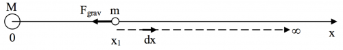

You have read about the [gravitational potential energy associated with a system consisting of an object and the Earth](https://www.msuperl.org/wikis/pcubed/doku.php?id=183_notes:grav_pe). This form of the gravitational potential energy turns about to be the [approximate form of the potential energy](/notes/week-08-potential-energy-applications/grav_pe_graphs/#how_is_delta_u_mgh_an_approximation) for two objects that interact gravitationally. The gravitational potential energy is a powerful tool for modeling the motion of objects that interact through the gravitational force. It will help you to predict and explain the motion of large, massive objects such as planets, moons, and comets. **In these notes, you will read about the general form of the gravitational potential energy.**

### Lecture Video



### (Near Earth) Gravitational Potential Energy

Earlier, you read how the gravitational potential energy (J) for a system consisting of two objects (the Earth and something on the surface of the Earth) is given by,

$$
\Delta U_{grav} = + mg\Delta y
$$

where the separation distance ($\Delta y$) is measured from the surface of the Earth. *In this previous calculation, you assumed that the gravitational force was a constant (*${\overset{\rightarrow}{F}}_{grav} = \langle 0, - mg,0\rangle$*) over the distances that you were considering.* This is an approximation, but it's not a bad one for the most part.

However, you will relax this condition now, because as you have read, that [the gravitational force between two objects with mass is not a constant vector](/notes/week-03-newtonian-gravitation/gravitation/).

## Newtonian Gravitational Potential Energy

In general, the gravitational force exerted on a object of mass $m_{1}$ due to an object of mass $m_{2}$ is non-constant,

$$
{\overset{\rightarrow}{F}}_{grav} = - G\frac{m_{1}m_{2}}{r^{2}}\widehat{r} \neq \ constant
$$

So for this force, what is the gravitational potential energy?

### Solve the One-Dimensional Problem First

Remember that the potential energy change is the negative change in the internal work ($\Delta U = - W_{int}$). So, you can calculate what the work done by the gravitational force would be and use that to determine that change in potential energy in going from location 1 to location 2,

$$
U_{grav} = - W_{F_{grav}} \rightarrow \Delta U_{grav} = - \int_{1}^{2}{\overset{\rightarrow}{F}}_{grav} \cdot d\overset{\rightarrow}{r}
$$

where we will first solve the one-dimensional problem.

$$
W_{F} = \int_{1}^{2}\overset{\rightarrow}{F} \cdot d\overset{\rightarrow}{r}\underset{(1D)}{\underbrace{=}}\int_{x_{1}}^{x_{2}}F(x)\ dx
$$

Consider a mass $M$ at the origin and a mass $m$ at position $x$, as shown in the figure below.

You can compute the work done by the gravitational force as the mass moves from $x = x_{1}$ to $x = \infty$.

The force on the little mass at any location $x$ is given by

$$
F_{grav}(x) = - G\frac{Mm}{x^{2}}
$$

where the minus indicates the force points to the left. Because the displacement ($dx$) is to the right, the work done by the gravitational force in this case is negative ($W_{grav} < 0$). This serves as a check for you as you do the calculation; the work that is calculated better be negative.

$$
W_{grav} = \int_{x_{1}}^{\infty}F(x)\ dx = - \int_{x_{1}}^{\infty}G\frac{Mm}{x^{2}}\ dx = G\frac{Mm}{x}|_{x_{1}}^{\infty} = - G\frac{Mm}{x_{1}}
$$

This potential energy is definitely negative because $x_{1}$ is a positive value. You can now determine the potential energy change,

$$
\Delta U_{grav} = - W_{grav} = + G\frac{Mm}{x_{1}}
$$

$$
\Delta U_{grav} = \underset{0}{\underbrace{U(x = \infty)}} - U(x_{1}) = + G\frac{Mm}{x_{1}}
$$

$$
U(x_{1}) = - G\frac{Mm}{x_{1}}
$$

### General form of the gravitational potential energy

Thus, in general, if we measure the radial distance from an object the gravitational potential energy varies inversely with the distance,

$$
U(r) = - G\frac{Mm}{r}
$$

First, notice that as the distance gets very large the potential energy goes to zero ($U \rightarrow 0$ as $r \rightarrow \infty$).

Second, notice that this is a slight notational change. The distance $r$ is the radial distance from the origin (or the object for which we consider to be at the origin). This value of $r$ is always positive.

As you will read, [plotting the potential energy](/notes/week-08-potential-energy-applications/grav_pe_graphs/) will help you make sense of it.
