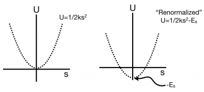
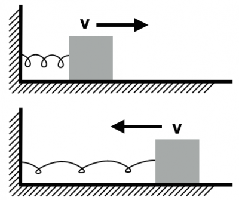
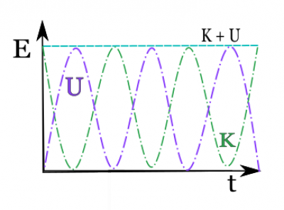

Earlier you read about [springs and the motion of spring-like systems](/notes/week-04-05-springs-contact-interactions/springmotion/). This provided the foundation to model solid materials [using the ball and spring model](/notes/week-06-solids-curved-motion/model_of_solids/). You were able to [predict the stretching of materials](/notes/week-06-solids-curved-motion/model_of_a_wire/) as well as [model contact interactions](/notes/week-04-05-springs-contact-interactions/friction/). **In these notes, you will revisit the [energy associated with spring interactions](/notes/week-07-energy-transfer/grav_and_spring_pe/#spring_potential_energy).**

## Spring Potential Energy

As you have read, the force associated with spring-like interactions is proportional to the stretch of the spring and points opposite the stretch direction,

$$
{\overset{\rightarrow}{F}}_{spring} = - k\overset{\rightarrow}{s}
$$

For now, let's consider this stretching occurs in a single direction, so that we only need to consider a single force component,

$$
F_{s} = - ks
$$

As you previously read, this [force can be associated with a potential energy](/notes/week-08-potential-energy-applications/force_and_pe/) because it depends solely position,

$$
F_{s} = - ks = - \frac{dU_{s}}{ds}
$$

$$
\frac{dU_{s}}{ds} = ks
$$

Integrating once gives the expression for the [potential energy that was obtained previously](/notes/week-07-energy-transfer/grav_and_spring_pe/#spring_potential_energy), but there's a overall constant term that is still remains as a result of indefinite integral.

$$
U_{s} = \int\frac{dU_{s}}{ds}ds = \int ks\ ds = \frac{1}{2}ks^{2} - E_{s}
$$

Here, it has been assumed that the constant term is a positive constant that will be subtracted from the term that depends on the stretch. This is fine to do because the resulting potential energy function still satisfies the [gradient relationship](/notes/week-08-potential-energy-applications/force_and_pe/) above.

### Lecture Video



*The contents of this video is to assist students in understanding spring potential energy.*

### The Zero of Potential Energy is Arbitrary

The zero of potential energy can be shifted without affecting the physics of the situation.

You might be puzzled by the idea of introducing any old constant into the potential energy expression above. Contrary to how it has been presented thus far, *the potential energy of a system is not absolutely defined.* You are free to choose the zero of potential energy.

This is a very powerful tool for physics because it allows you to model the system using potential energy in ways that make more sense conceptually. For example, the expression for the spring potential energy without the constant term is always positive, which might lead you to believe the [total energy is positive and thus there can be no bound states](/notes/week-08-potential-energy-applications/grav_pe_graphs/#graphing_kinetic_energy). But that is not your observation! The spring mass system is a bound state, the mass does not travel beyond a maximum stretch.

***By subtracting off a positive constant, you can renormalize the energy such that it is overall negative and the concept of bound states (resulting form negative total energy) still makes sense.***

This might still bother you, but remember that you care about the *change in potential energy*. That's what tells you about the other changes in energy (namely kinetic). The constant term is always subtracted from itself in that case and drops out.

### Energy Flow in a Spring-Mass System

The motion of a horizontal spring-mass system within a closed system during oscillation.

To determine how the energy flows in a spring-mass system, consider a spring attached to a wall on one end and to a mass that moves horizontally over a frictionless table on the other. If you consider the spring and mass to be the system, then the wall, table, and Earth are in the surroundings. From the energy principle,

$$
\Delta E_{sys} = W_{surr}
$$

$$
\Delta K + \Delta U_{s} = W_{surr}
$$

Remember, Energy and Work share the unit of Joules (J). In this situation, the wall, table, and Earth exert forces, but do they do any work?

- The Earth exerts a force directed downward, perpendicular to the motion. Thus, the Earth does no work on the system.
- The table is frictionless, so the only force it exerts is perpendicular to the motion. Thus, the table does not work.
- The wall exerts a force parallel to the motion. However, the wall undergoes no displacement and therefore does no work on the system.

Hence, the system's energy is conserved,

$$
\Delta K + \Delta U_{s} = 0
$$

$$
\Delta K = - \Delta U_{s}
$$

The energy flows back and forth between kinetic and potential. When the spring is compressed fully, the potential energy is a maximum and the kinetic is zero. As the spring decompresses, the kinetic increases, and the potential decreases. As the system goes the springs relaxed length, the kinetic is a maximum and the potential is zero. All the while the total energy is a constant. This can be visualized in the graph below.

### Examples

- [Energy in a Spring-Mass System](https://www.msuperl.org/wikis/pcubed/doku.php?id=183_notes:examples:energy_in_a_spring-mass_system)
- [Rebounding Block](https://www.msuperl.org/wikis/pcubed/doku.php?id=183_notes:examples:a_rebounding_block)
