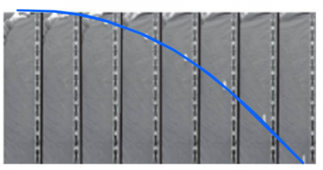
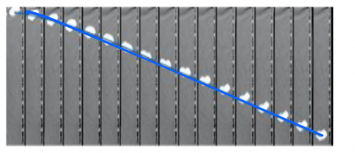

You have read that [energy is always conserved](https://www.msuperl.org/wikis/pcubed/doku.php?id=183_notes:energy_cons). This is a true observable fact of the universe. Energy cannot be created or destroyed, it simply changes forms. However, sometimes those forms are less useful to us. For example, the increased thermal energy of a box due to the frictional interaction with the surface it is pushed across is unlikely to be useful. This type of transformation of energy is often referred to as “dissipating” energy. **In these notes, you will read about one form of energy dissipation that is due to collisions with air molecules: air resistance.**

## Air Resistance

Earlier you read about different [models of fluid resistance](/notes/week-02-modeling-motion-net-force/drag/). One of those models was for fast moving objects in media that is not very viscous. This is the classical example of air resistance, which can have real effects.

Let's say you dropped a metal ball from rest. Below is a set of frames (taken at equal time intervals) from a video of a metal ball being dropped straight down. Notice the ball's displacement increases as each time step elapses. The effect of air resistance is very small. To a reasonable degree, we can [model this motion using constant force](/notes/week-02-modeling-motion-net-force/constantf/).

If you instead dropped a coffee filter, you would observe something all together different. The frames below are taken from a video of a coffee filter dropped from rest. Notice that the displacement between each frame is roughly the same (especially near the end of the video). This latter motion could be modeled to a reasonable degree [using constant velocity motion](/notes/week-01-modeling-motion-no-net-force/displacement_and_velocity/).

## Where does the energy go?

What is curious about the motion of the coffee filter is that there is certainly a change in the potential energy of the coffee filter and Earth system, but there's no change in the kinetic energy of the coffee filter. It is moving at a constant speed. Thus, there must be some work done by the surroundings.

$$
\Delta E = W_{surr}
$$

$$
\underset{0\ in\ later\ frames}{\underbrace{\Delta K_{filter}}} + \Delta U_{grav} = W_{surr}
$$

The kinetic energy of the coffee filter doesn't change much after a short while because the forces acting on the filter are balanced. That is, the force gravitational force and the force of the air are the same size. This results in a condition called [terminal velocity](http://en.wikipedia.org/wiki/Terminal_velocity), which is also a [terrible film](http://www.imdb.com/title/tt0111400/).

$$
{\overset{\rightarrow}{F}}_{net} = {\overset{\rightarrow}{F}}_{grav} + {\overset{\rightarrow}{F}}_{air} = 0
$$

$$
{\overset{\rightarrow}{F}}_{grav} = - {\overset{\rightarrow}{F}}_{air} \rightarrow F_{grav} = F_{air}
$$

$$
mg = cv_{terminal}^{2} \rightarrow v_{terminal} = \sqrt{\frac{mg}{c}}
$$

where $c$ is a constant that contains all the constants in the [turbulent drag force formula](/notes/week-02-modeling-motion-net-force/drag/). As a result, the work done by the surroundings is equal to the change in gravitational potential energy.

$$
W_{surr} = \Delta U_{grav}
$$

*What can do work on the coffee filter if the Earth is in the system? The air molecules collide with the coffee filter as it falls down. These molecules are struck by the filter on the way down and have their kinetic energy increased.* The energy of the Earth-filter system is dissipated by the air. The air molecules gain kinetic energy, which cannot really be used for anything useful.
