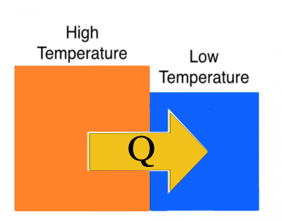

Earlier, you read about [work](/notes/week-07-energy-transfer/work/), which is the mechanical energy transfer of energy into or out of a system. This energy transfer is due to physical displacements of the system over macroscopic distances by the external forces acting on the system. When you place a hot object near a cold one, you observe an energy transfer from the hot object to the cold object, but this is not due to macroscopic work (i.e., pushes and pulls over observable distances). **It is instead due to the microscopic work done by the atoms in contact at the boundary. In time, this microscopic work propagates through the whole cold object. In these notes, you will read about that process.**

## Lecture Video



## Two Blocks in Contact

The hotter block will transfer energy across the boundary to the cooler block through microscopic work, $Q$.

Two blocks are placed in contact (figure to right). One block is hot (red) and the other is cold (blue). Your experience tells you that in time, the hot block will become cooler and the cold block will become warmer. Eventually, the two blocks will [achieve the same (intermediate) temperature](/notes/week-10-internal-energy-heat/internal_energy/#achieving_thermal_equilibrium).

How does this happen?

The average kinetic energy of atoms in the high-temperature block is higher than the low-temperature block. Some of this [energy is due to the random motions of the atoms](/notes/week-10-internal-energy-heat/internal_energy/#thermal_energy_is_due_to_random_motion), which we refer to as thermal energy. So on average, the atoms in the high-temperature block are “jiggling” more, and thus have more thermal energy per atom.

At the interface, faster moving atoms in the high-temperature block collide with slower-moving a
