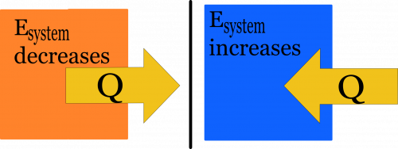

Earlier, you read about [work](/notes/week-07-energy-transfer/work/), which is the mechanical energy transfer of energy into or out of a system. This energy transfer is due to physical displacements of the system over macroscopic distances by the external forces acting on the system. When you place a hot object near a cold one, you observe an energy transfer from the hot object to the cold object, but this is not due to macroscopic work (i.e., pushes and pulls over observable distances). **It is instead due to the microscopic work done by the atoms in contact at the boundary. In time, this microscopic work propagates through the whole cold object. In these notes, you will read about that process.**

## Lecture Video



## Two Blocks in Contact

The hotter block will transfer energy across the boundary to the cooler block through microscopic work, $Q$.

Two blocks are placed in contact (figure to right). One block is hot (red) and the other is cold (blue). Your experience tells you that in time, the hot block will become cooler and the cold block will become warmer. Eventually, the two blocks will [achieve the same (intermediate) temperature](/notes/week-10-internal-energy-heat/internal_energy/#achieving_thermal_equilibrium).

How does this happen?

The average kinetic energy of atoms in the high-temperature block is higher than the low-temperature block. Some of this [energy is due to the random motions of the atoms](/notes/week-10-internal-energy-heat/internal_energy/#thermal_energy_is_due_to_random_motion), which we refer to as thermal energy. So on average, the atoms in the high-temperature block are “jiggling” more, and thus have more thermal energy per atom.

At the interface, faster moving atoms in the high-temperature block collide with slower-moving atoms in the low-temperature block transferring energy across the boundary. These atoms collide with their neighbors within their own block and the energy is propagated across the rest of the block. You can think about this as work is done by motion of atoms, but it's not [macroscopic work in the sense that you read about earlier](/notes/week-07-energy-transfer/work/). It is instead the microscopic work is done by atomic collisions, which we refer to as $Q$ – the energy transfer due to a temperature difference.

Because each atom has a different kinetic energy, it is possible that a fast-moving atom from the low-temperature block will transfer kinetic energy to a slow-moving atom in the high-temperature block. However, this is less likely than the reverse because there are more atoms on average with high kinetic energies in the high-temperature block.

The net result is an energy transfer across the boundary of the two blocks from the hot block to the cold block. This is also referred to as the *heat exchanged*, but be careful using the word *heat* as it has colloquial definitions that are not scientific. For example, an object does not have heat, it has thermal energy.

### The Energy Principle

You now have a complete description of the energy principle. **The change in energy of a system is due both to macroscopic and microscopic work.**

$$
Energy\ change\ of\ a\ system = Macroscopic\ work + Microscopic\ work
$$

$$
\Delta E_{sys} = W_{surr} + Q
$$

## Q Can Be Positive(+) or Negative(-)

The microscopic work ($Q$) can be positive or negative, just as [you found with macroscopic work](/notes/week-07-energy-transfer/work/#work_can_be_positive_negative_or_zero). But, the difference here depends on the choice of system and not the direction of forces and displacements.

For now, consider a system that just exchanges energy through $Q$ (i.e., there is no macroscopic work done).

$$
\Delta E_{sys} = Q
$$

If the system under consideration is warmer than its surroundings, then it will increase the thermal energy of its surroundings (raise the temperature of the surroundings). At the same time, the temperature of the system itself will fall. Thus, the total energy of the system will decrease ($\Delta E_{sys} < 0$). Hence, the sign of $Q$ is also negative. Energy has been transferred out of the system. This is represented by the red block below.

If, instead, the system under consideration is cooler than its surroundings, then it will decrease the thermal energy of its surroundings (lower the temperature of the surroundings). At the same time, the temperature of the system itself will rise. Thus, the total energy of the system will increase ($\Delta E_{sys} > 0$). Hence, the sign of $Q$ is positive. Energy has been transferred into the system. This is represented by the blue block below.

## Examples

- [An electric heater](/examples/an_electric_heater/)
- [Video Example: Spring Potential, Work, and Heat exchange](/examples/videoswk9/)
