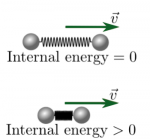
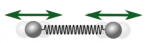
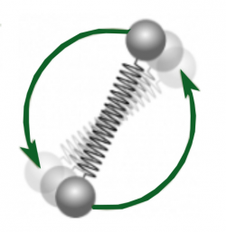
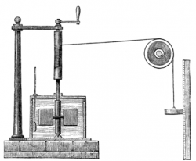

Up to now, you have read about systems that have no internal structure: [point particle systems](/notes/week-07-energy-transfer/point_particle/). Even when considering a [multi-particle system](https://www.msuperl.org/wikis/pcubed/doku.php?id=183_notes:energy_cons#multi-particle_systems), you have worked with uniquely identifiable objects. Now, you will read about the energy associated with systems that have some structure. **In these notes, you will read about the connection between [the concept of energy](/notes/week-07-energy-transfer/define_energy/) to [the ball and spring model of the solid](/notes/week-06-solids-curved-motion/model_of_solids/).** This leads to the concept of thermal energy and how thermal energy is transferred into and out of systems.

## Lecture Video



## Systems With Structure Can Have Internal Energy

Two systems with different internal energies, but identical kinetic energies.

*Until now, you have considered systems of point particles, which have no internal structure. You will now relax in that condition.*

Consider two systems of two particles (each of mass $m$) attached by a spring ($k_{s}$) moving to the left with a speed $v$ (figure to left). For one of the systems, the spring is at its relaxed length. For the other, the spring is compressed by a massless string tied around the objects. Which system has more energy?

Clearly, both have the same kinetic energy ($K = \frac{1}{2}(M)v^{2}$; $M$ is the total mass of the system). But what about the energy associated with spring compression that is internal to the system? The object with the compressed spring has more *internal energy*. These are the kinds of energy distinctions that you will need to make when objects have structure.

## Internal Energy Can Take Different Forms

 

You have already seen one form of internal energy (i.e., when a spring is compressed). It can be useful to be able to unpack the different forms of internal energy to work on a particular problem of interest. An object that is rotating about its center of mass will have internal energy associated with rotation: **rotational energy**. While an object that is oscillating with respect to its center of mass will have energy due to vibrations: **vibrational energy**. When you eat food, you increase your internal energy in the form of **chemical energy**. A system whose temperature increases will increase its **thermal energy**.

As you [read previously](/notes/week-07-energy-transfer/point_particle/), the total mass of the system is related to the system's total energy ($M_{sys} = E_{sys}/c^{2}$). This indicates that systems with more internal energy will have more mass. However, from a practical standpoint, the enormous rest mass energy associated with macroscopic system overshadows these contributions to the total energy meaning it only makes sense to worry about changes in internal energy whether they be rotational, vibrational, thermal, et cetera.

The total internal energy of a system is given by the sum of all the possible forms of internal energy that the system can have,

$$
Internal\ energy = E_{thermal} + E_{rotational} + E_{vibrational} + E_{chemical} + \ldots
$$

## Thermal Energy is due to Random Motion

In this section, we will focus on thermal energy. You have [modeled atoms in a solid as single particles connected by a spring](/notes/week-06-solids-curved-motion/model_of_solids/). As you might have learned in your chemistry course, these atoms can have [rotational states](http://en.wikipedia.org/wiki/Rotational_transition) and [vibrational states](http://en.wikipedia.org/wiki/Molecular_vibration). The internal energy associated with vibrational and rotational states does not increase the thermal energy (or temperature) of the solid material.

Thermal energy is associated with random motion of the atoms in the solid and is not recognized as collective behavior. It is distinct from the rotation and vibration of atoms as well. This random component of the internal energy is thermal and we associate it with the temperature of the solid. The higher the thermal energy of a particular solid, the more the atoms *jiggle* randomly, and the higher the temperature of that solid.[1)](/notes/week-10-internal-energy-heat/internal_energy/#fn__1)

## Lecture Video



## Quantifying Thermal Energy Using Temperature

Joule's experimental apparatus that demonstrated that how energy and temperature are connected.

In the 1800s, [James Joule](http://en.wikipedia.org/wiki/James_Prescott_Joule) connected energy with temperature in [his famous paddle wheel experiment](http://en.wikipedia.org/wiki/James_Prescott_Joule#The_mechanical_equivalent_of_heat). In his experiment, a rotating paddle wheel submerged in water was connected to a falling mass. Joule was able to measure the gravitational potential energy change associated with the falling mass and the temperature change of the water.

He discovered that it required 4.2 J to raise the temperature of a single gram of water by 1 Kelvin (1 K). This lead to the idea of **heat capacity**. The heat capacity of an object is the amount of energy needed to raise its temperature by 1 Kelvin. The **specific heat capacity** is a property of the material. It is the amount of energy needed to raise 1 gram of the material by 1 Kelvin. For example, the specific heat capacity of water (as measured by Joule) is 4.2 J per gram per Kelvin (4.2 J/K/g). For other materials, their specific heat capacities are different (e.g., 2.4 J/K/g for ethanol and 0.4 J/K/g for copper). Water has a very large specific heat capacity, so it requires a lot of energy to change its temperature.

The relationship between the thermal energy change of a material ($\Delta E_{thermal}$), the specific heat capacity ($C$), and the temperature change ($\Delta T$) is given by,

$$
C = \frac{\Delta E_{thermal}}{m\Delta T}
$$

$$
\Delta E_{thermal} = mC\Delta T
$$

where $m$ is the mass of the material.

It is possible to relate the atomic picture of thermal energy (i.e., increased random motion) to the macroscopic picture (i.e., increased temperature), but doing so requires [knowledge of entropy](http://en.wikipedia.org/wiki/Entropy). We can check our macroscopic measurements with these predictions if desired. These initial calculations were due to the work of [Pierre Louis Dulong and Alexis Thérèse Petit](http://en.wikipedia.org/wiki/Dulong%E2%80%93Petit_law) and, later, [Einstein](http://en.wikipedia.org/wiki/Einstein_solid).

## Achieving Thermal Equilibrium

Two objects that are in contact but have different temperatures will eventually come to have the same temperature. This equilibration occurs as the higher temperature object transfers thermal energy through microscopic collisions at the interface between the two objects. These atoms at the interface collide with atoms further embedded in the lower temperature material and continue to propagate through the atoms of the lower temperature object. This microscopic work done on the atoms in the lower temperature object is called *heat*. Heat is the energy transfer due to a temperature difference. Eventually, atoms in both objects on average are *jiggling* similarly, and thus both objects have the same temperature.

Macroscopically, the thermal energy that the (initially) higher temperature object exchanges as heat results in a equal rise in the thermal energy of the (initially) lower temperature object.

------------------------------------------------------------------------

[1)](/notes/week-10-internal-energy-heat/internal_energy/#fnt__1)

In fact, the temperature is related to both the energy and the [entropy of the system](http://en.wikipedia.org/wiki/Entropy). In particular how the energy changes with entropy, but for now, you think of thermal energy as having a direct connection to the temperature of the solid.
