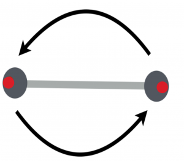
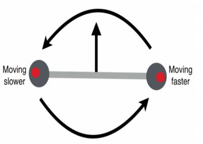

You have read about the [motion of the center of mass of a system](/notes/week-06-solids-curved-motion/center_of_mass/) from the perspective of the momentum principle. **In these notes, you will read about how this motion can be connected to the energy of a multi-particle system, and how different kinetic energy terms can separated out from the total kinetic energy to be discussed and thought about separately.**

### Lecture Video



## The Total Kinetic Energy of a System is the Sum of All Its Parts

Atoms (red circles) on either side of the center of a twirled baton have the same speed.

This might seem obvious to you, but you should realize that the *total kinetic energy of any multi-particle system is the sum of all the individual kinetic energies of the particles or objects that make up the system*. *The only caveat is that the velocity of all the constituent particles must be measured in the [same frame of reference](/notes/week-01-modeling-motion-no-net-force/relative_motion/#relative_motion).* Otherwise, we would get different speeds for each particle depending on its relative motion in the different frames.

$$
K_{tot} = \sum_{i}^{}K_{i} = \sum_{i}^{}\frac{1}{2}m_{i}v_{i}^{2}
$$

### Twirling a Baton

Atoms (red circles) on either side of the center of a twirled and tossed baton have different speeds.

Consider a baton that is being twirled in a circle in someone's hand. As the baton is twirled, each atom in the baton moves in a circle at a speed that depends on how far the atom is from the center of the baton. You could add up all the individual velocities of the atoms to get the total kinetic energy of the baton. This is fairly simple (but painful) to do. The kinetic energy of atoms on either side of the center (but at the same distance from it) has the same kinetic energy because they move at the same speed.

Now, consider that this baton is now tossed into the air while it twirls. The whole baton is moving up with a known speed. The kinetic energy of the baton has increased because the baton is both translating and rotating. [1)](/notes/week-11-multi-particle-energy/energy_sep/#fn__1) **In this case, you can still add up the velocities of each atom, but now you have taken into account the translational velocity of the whole baton.**

Consider a pair of atoms that are the same distance from the center of the baton (red circles in the figure to the right). At this instant, the atom on the right is moving up as the baton rotates. The atom on the left is moving down. Relative to the fixed frame of the ground, the atom on the right, at this instant, is moving faster than the atom on the left. This is another form of [the relative velocity motion that you read about earlier](/notes/week-01-modeling-motion-no-net-force/relative_motion/). Adding up all the kinetic energies of the atoms here is a real pain. Luckily, we can separate the motion of the center of mass of the baton from the motion *around* the center of mass, making this energy calculation simpler.

## Separating the Total Kinetic Energy in a Multi-Particle System

The total kinetic energy of a multi-particle system easily separates into the translational kinetic energy associated with the motion of the center of mass and the motion relative to the center of mass.

$$
K_{tot} = K_{trans} + K_{rel}
$$

This relative kinetic energy includes motion due to rotation about the center of mass (as in the above baton example) and oscillations or vibrations of the object. A derivation of this relationship (if you are interested) is [available here](https://www.msuperl.org/wikis/pcubed/doku.php?id=183_notes:sep_k_ex).

$$
K_{rel} = K_{vib} + K_{rot}
$$

There is a formal derivation of this equality, but it is more important that you understand conceptually the idea of separating the energy due to translation of the center of mass ($K_{trans}$) and energy due to motion relative to the center of mass ($K_{vib}$ and $K_{rot}$).

### Translational Kinetic Energy

In physics, the word **translation** means to move from one location to a different location. When you are interested in how a multi-particle system moves, you might want to track how the whole system moves from one location to another. This motion is captured by the motion of the center of mass. That is, you are avoiding the details of how the system rotates or vibrates and are just following the “bulk” motion. The motion of the center of mass is described by the velocity of the center of mass, $v_{cm}$, which you have [read about earlier](/notes/week-06-solids-curved-motion/center_of_mass/). The translational kinetic energy is associated with this motion (remember no rotation or vibration) and is given by,

$$
K_{trans} = \frac{1}{2}M_{tot}v_{cm}^{2}
$$

where the total mass of the system ($M_{tot}$) is under consideration. Here, you only consider systems moving slowly compared to the speed of light ($v_{cm} \ll c$).

### Vibrational Kinetic Energy

You read about the [energy associated with vibrations earlier](/notes/week-08-potential-energy-applications/spring_pe/), but this energy contained both potential and kinetic terms. That is, the total energy due to vibrations is due to the potential energy associated with the interaction causing the vibrations and the kinetic energy of the vibrations themselves. It's clear there can be energy due to vibration even if the center of mass doesn't move. Think about the [spring-mass oscillations from previous notes](/examples/energy_in_a_spring-mass_system/).

$$
E_{vib} = K_{vib} + U_{s}
$$

In terms of separating the energy into different terms, you are only interested in the kinetic energy portion of this energy, but it is hard to separate from the potential unless you have a known set of conditions (e.g., precisely how compressed the spring is at a given time/location). So, in a sense, it can be easier to think about the total energy of a system and the vibrational portion is the bit that's left over. Below, the rotational kinetic energy has been left out.

$$
E_{tot} = K_{trans} + K_{vib} + U_{s} + E_{rest}
$$

$$
K_{vib} = E_{tot} - (K_{trans} + U_{s} + E_{rest})\ at\ a\ given\ time/location
$$

Here, the vibration energy can be calculated by knowing the other energy terms at a given time and location.

### Rotational Kinetic Energy

Just as there can be kinetic energy associated with vibrations without motion of the center of mass (i.e., no translation), there can energy associated with rotation even if the center of mass is at rest. Consider the twirled baton example that motivated these notes.

You will read much more about [rotational kinetic energy](/notes/week-11-multi-particle-energy/rot_ke/) later, but it suffices to say, there was kinetic energy due only to rotation about the center of mass in the case of the twirled baton and that energy could be (in principle) calculated by considering the motion of each atom in the baton. You will find a more straight-forward, and less time-consuming way to calculate this energy [later](/notes/week-11-multi-particle-energy/rot_ke/).

### (Near Earth) Gravitational Potential Energy

Up to now, you have considered only the kinetic energy associated with multi-particle systems, but what about the potential energy, namely, the gravitational potential energy near the Earth's surface. The atoms in an object that extends over some vertical height will share different amounts of gravitational potential energy with the Earth as a function of their height.

$$
U_{atom} = m_{atom}gy_{atom}
$$

Those that are higher up will share more potential energy with the Earth than those lower to the ground. Those that are at the same height but different horizontal positions experience the same potential energy.[2)](/notes/week-11-multi-particle-energy/energy_sep/#fn__2)

If we consider a column of such atoms, that extends up some vertical height. The total potential energy associated with this column is given by the sum of the contributions due to each of the atoms,

$$
U_{tot} = \sum_{i}^{}U_{atom,i} = \sum_{i}^{}m_{atom,i}\mspace{6mu} g\mspace{6mu} y_{atom,i} = g\sum_{i}^{}m_{atom,i}\mspace{6mu} y_{atom,i}
$$

This final sum is related to the [center for mass formula](/notes/week-06-solids-curved-motion/center_of_mass/#the_center_of_mass) in the y-direction,

$$
y_{cm} = \frac{1}{M_{tot}}\sum_{i}^{}m_{atom,i}\mspace{6mu} y_{atom,i}
$$

$$
M_{tot}y_{cm} = \sum_{i}^{}m_{atom,i}\mspace{6mu} y_{atom,i}
$$

Hence, this sum can be replaced by the product of the total mass of the system and the location of the center of mass,

$$
U_{tot} = M_{tot}gy_{cm}
$$

That is, the near Earth gravitational potential energy shared between a multi-particle system and the Earth, is mathematically equivalent to the energy shared by a point particle of mass $M_{tot}$ located at the center of mass, $y_{cm}$.

------------------------------------------------------------------------

[1)](/notes/week-11-multi-particle-energy/energy_sep/#fnt__1)

Translation is the motion that you have worked on within the past. It is the motion of point particles, no rotation or oscillation, but it can be constant or accelerated motion.

[2)](/notes/week-11-multi-particle-energy/energy_sep/#fnt__2)

This argument requires all atoms to have the same mass, but can be extended to more general systems without loss of generality.
