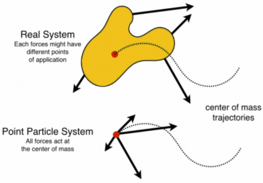
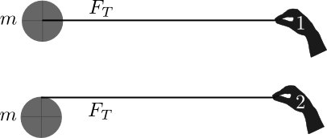

Until now, you read about the motion and energy of systems that are rigid, that is, they do not deform or change their shape. There are many applications where systems change their shape. Being able to analyze the motion and the transformation of energy in such systems is important to be able to predict and explain how these systems behave. Examples of these kinds of deformable systems are everywhere including children's toys (e.g., [yo-yo](http://en.wikipedia.org/wiki/Yo-yo)), engineering applications (e.g., engines such as [rhombic drives](http://en.wikipedia.org/wiki/Rhombic_drive)), and car accidents, which will be [discussed later](/notes/week-08-potential-energy-applications/colliding_systems/). **In these notes, you will read about how to analyze simpler forms of these deformable systems using the *point particle* or center of mass system.**

### Lecture Video



### Energy in the Point Particle System

These deformable systems can be quite complicated because these systems have some structure and size, they are not [point objects](/notes/week-07-energy-transfer/point_particle/). **External forces can be applied to different locations and the resulting motion can produce vibrations, rotations, and temperature changes, as well as translations.** However, you can simplify the system significantly by modeling it as a point particle located at its [center of mass](/notes/week-06-solids-curved-motion/center_of_mass/). Doing so, allows you to determine the translation kinetic energy change of the system, but nothing else. A [point particle has no internal structure](/notes/week-07-energy-transfer/point_particle/), so it cannot vibrate, rotate, or experience any temperature change. This is because the forces acting on the different parts of the system add to produce the net force, which (in this model) acts at the center of mass. **The work done by this force over the displacement of the center of mass precisely determines the translation kinetic energy of the system.**

Modeling a deformable, extended system as a point particle means tracking the motion of the center of mass.

Modeling the system in this way uses a form of the energy principle that describes only how the translational kinetic energy of the system will change because it makes use of the [momentum principle for multi-particle systems](/notes/week-04-05-springs-contact-interactions/mp_multi/#the_momentum_principle_for_multiple_particles) to do so. The multi-particle momentum principle describes how the momentum of a system changes as a result of the forces external to the system,

$$
\frac{d{\overset{\rightarrow}{p}}_{sys}}{dt} = {\overset{\rightarrow}{F}}_{ext}
$$

[As you might remember](/notes/week-06-solids-curved-motion/center_of_mass/), the momentum of the system is directly related to the total mass of the system ($m$) and the velocity of the center of mass (${\overset{\rightarrow}{v}}_{cm}$),

$$
{\overset{\rightarrow}{p}}_{sys} = m{\overset{\rightarrow}{v}}_{cm}
$$

This description of the system's momentum can be used to determine the translation kinetic energy of the system (which is also the kinetic energy associated with the motion of the center of mass). You can also show that this is precisely the work done by the net force over the displacement of the center of mass. Consider integrating the multi-particle momentum principle from some initial state to some final state,

$$
\int_{i}^{f}\frac{d{\overset{\rightarrow}{p}}_{sys}}{dt} \cdot d{\overset{\rightarrow}{r}}_{cm} = \int_{i}^{f}{\overset{\rightarrow}{F}}_{ext} \cdot d{\overset{\rightarrow}{r}}_{cm}
$$

$$
\int_{i}^{f}m\frac{d{\overset{\rightarrow}{v}}_{cm}}{dt} \cdot d{\overset{\rightarrow}{r}}_{cm} = \int_{i}^{f}{\overset{\rightarrow}{F}}_{ext} \cdot d{\overset{\rightarrow}{r}}_{cm}
$$

$$
\int_{i}^{f}m\,{\overset{\rightarrow}{v}}_{cm} \cdot d{\overset{\rightarrow}{v}}_{cm} = \int_{i}^{f}{\overset{\rightarrow}{F}}_{ext} \cdot d{\overset{\rightarrow}{r}}_{cm}
$$

The left-hand side of this equation describes how the kinetic energy of the center of mass changes. A proof of that calculation is [provided here](/notes/week-11-multi-particle-energy/proof_of_pp/), but simply knowing that you can describe the kinetic energy of the center of mass in this way is more important. The right-hand side might be easier to see as the work done by the net external force in moving the center of mass from some initial location to some final location.

The resulting energy principle for a point particle system is given by,

$$
\Delta K_{trans} = \frac{1}{2}M_{tot}v_{cm,f}^{2} - \frac{1}{2}M_{tot}v_{cm,i}^{2} = \int_{i}^{f}{\overset{\rightarrow}{F}}_{ext} \cdot d{\overset{\rightarrow}{r}}_{cm} = W_{cm}
$$

To analyze the translation kinetic energy using the point particle system, imagine taking your deformable system and compressing it down to a point, which is located at the center of the mass of the system. Allow the net external force to act at the center of mass (this is the *point of application of the net force* in the point particle system). Follow the displacement of the center of mass. The work done in the point particle system is the scalar product of the net force and displacement of the center of mass. By the point particle energy principle, this work is mathematically equivalent to the translation kinetic energy of the system.

### Energy in the Real System

You have already read about the [energy of real systems](https://www.msuperl.org/wikis/pcubed/doku.php?id=183_notes:energy_cons). The word *real* here means that actual physical system where you must consider the point of application of each force, and the work done by each force (which might occur over different displacements). In this case, the total energy change of the system is the result of the total (macroscopic) work done by the surroundings and energy changes due to temperature differences between the system and the surroundings (microscopic work).

$$
\Delta E_{sys} = W_{surr} + Q
$$

What is particularly important here is that you are able to determine the total work that is done by different forces acting on the system. Each force might act through a different displacement, so you will have to keep track of that when calculating the total force. The total energy of the system may take many forms: translational, rotational, and vibrational kinetic energy, as well as potential and thermal forms.

In the real system, you need information about each force, the point of application of each force, and the distance through which each force acts. From the real system, you gain information about the total energy of the system.

In the point particle system, you need information about the net force and the center of mass; the point of application of the net force is the center of mass and it acts through the displacement of the center of mass. From the point particle system, you gain information about the translational kinetic energy of the system only.

## An Application

This might all seem abstract right now, but consider two pucks with the same mass ($m$) that are pulled across an icy surface. Puck 1 has the rope attached to its center and Puck 2 has the rope wound about its edge (see below).

### Both Pucks Travel The Same Distance

Both pucks start from rest and are pulled with the same force ($F_{T}$) over the same amount of time. But, Puck 2 will rotate as the rope is unwound from the edge of the puck. Because both pucks experience the same force over the same time, both will have the same final momentum,

$$
\Delta{\overset{\rightarrow}{p}}_{puck} = {\overset{\rightarrow}{F}}_{T}\Delta t
$$

This means that both experience the same translation kinetic energy change,

$$
{\overset{\rightarrow}{p}}_{puck} = m{\overset{\rightarrow}{v}}_{cm} \rightarrow \Delta K_{trans} = \frac{1}{2}m\, v_{cm}^{2} - 0
$$

Consider the point particle system for each puck. Because both experience the same change in their translation kinetic energy, the work done in the point particle system must be the same. There is only the pulling force acting on each puck, hence the displacement of the center of mass for each puck must be precisely the same. That is, while it might appear they should move different distances, the point particle energy principle tells you that the displacement of the center of mass of each puck must be the same. Below, this distance is called $d$.
