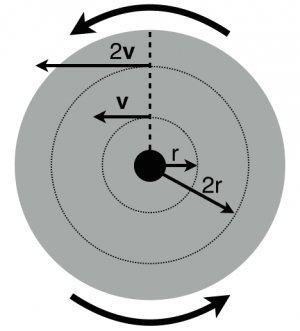
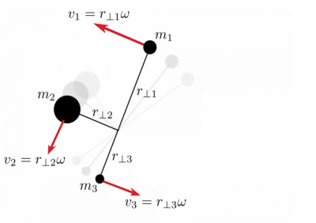
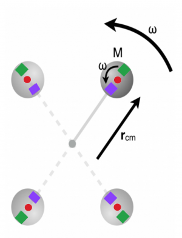
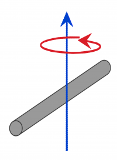
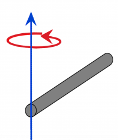
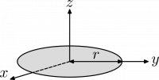
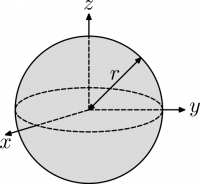
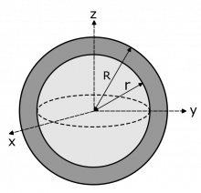

Earlier, you read about [how to separate the different forms of kinetic energy](/notes/week-11-multi-particle-energy/energy_sep/) (translation, vibrational, and rotational). **In this set of notes, you will read about the kinetic energy that is due to rotation about the center of mass. In these notes, you will also be introduced to the moment of inertia – a conceptual tool that arises because some things are more difficult to rotate than others.**[1)](/notes/week-11-multi-particle-energy/rot_ke/#fn__1)

## Atoms in Rotating Objects Can Move with Different Speeds

A circular disk rotates at a constant rate.

Consider a circular disk (like a merry-go-round) that is rotating at a constant rate. The disk rotates through 360$^{\circ}$ (2$\pi$ radians) in a known time $T$. Atoms in the disk also rotate at the same constant rate, turning through the full 2$\pi$ radians in that same time $T$. The rate at which this rotation occurs is given by the *angular speed*.

$$
\omega = \frac{2\pi}{T}
$$

where the angle through which the disk turns is 2$\pi$ in a time $T$. **The angular speed is measured in units of radians per second (rads/s) because the angular “distance” is related to the arc length (**$s = r\theta$**).** The angular speed is the same for every atom in the disk because all of them turn through the same angle in the same amount of time. However, some atoms cover larger distances in that time.

Consider two atoms, one located a distance $r$ from the center of the disk and another that is $2r$ from the center. In the amount of time it takes to rotate around once, the atom at $r$ will have traveled a distance equal to the circumference of a circle of radius $r$ (i.e., $2\pi r$). The atom that is farther out will have traveled through a larger distance equal to the circumference of a circle of radius $2r$ (i.e., $2\pi 2r$). The *tangential velocity* of the atoms is related to those distances. For example, for the closer of the two atoms,

$$
v(r) = \frac{2\pi r}{T} = \frac{2\pi}{T}r = \omega r
$$

*From this, you find that the tangential velocity of the atoms increases linearly with the distance from the center of the disk.*

## Lecture Video



## The Rotation of Rigid Objects

The merry-go-round is an example that demonstrates that you need to keep track of how far objects are from the center of mass when they are rotating. But to determine the kinetic energy of the merry-go-round can be tough because we have to consider how each atom contributes to the kinetic energy. You will read how to do that in a bit, but for now consider the system in the figure to the right that rotates at a constant angular speed, $\omega$.

The kinetic energy of this system is the sum of the individual kinetic energies of the four individual particles.

$$
K = \frac{1}{2}m_{1}\, v_{1}^{2} + \frac{1}{2}m_{2}\, v_{2}^{2} + \frac{1}{2}m_{3}\, v_{3}^{2} + ...
$$

Each of these velocities can be described in terms of the distance to the particles and the angular speed of the whole apparatus (e.g., $v_{1} = r_{\bot 1}\omega$).

$$
K = \frac{1}{2}m_{1}\,(r_{\bot 1}\omega)^{2} + \frac{1}{2}m_{2}\,(r_{\bot 2}\omega)^{2} + \frac{1}{2}m_{3}\,(r_{\bot 3}\omega)^{2} + ...
$$

You can group the terms and find that there's a relationship between the total kinetic energy and the angular speed.

$$
K = \frac{1}{2}\left( m_{1}\, r_{\bot 1}^{2} + m_{2}\, r_{\bot 2}^{2} + m_{3}\, r_{\bot 3}^{2} + ... \right)\omega^{2}
$$

The use of the symbol $\bot$ here is to remind you that the distance measured from the object to the rotation axis is the perpendicular distance to the axis.

### The Moment of Inertia

The quantity in parentheses is called the *moment of inertia*. For discrete, identifiable particles (mass $m_{i}$) with positions given by $r_{\bot\, i}$, it is written like this,

$$
I = m_{1}\, r_{\bot 1}^{2} + m_{2}\, r_{\bot 2}^{2} + m_{3}\, r_{\bot 3}^{2} + \cdots = \sum_{i}^{}m_{i}\, r_{\bot i}^{2}
$$

The units of the moment of inertia are ${kg\, m}^{2}$. The momentum of inertia allows you to write the kinetic energy in a more compact way,

$$
K = \frac{1}{2}I\omega^{2}
$$

The moment of inertia can be conceptualized as how “easy” it is to rotate something. An object that has a larger moment of inertia will require more energy to rotate it at the same angular velocity as compared to an object with a smaller moment of inertia.

## Moment of Inertia for Continuous Objects

Up to now, you have read about the moment of inertia for systems where you can identify individual particles. But for objects that are continuous solid objects (like the merry-go-round above), you have to use calculus to determine the moment of inertia to add up all the contributions. From there, you can determine the rotational kinetic energy,

$$
K = \frac{1}{2}I\omega^{2}
$$

The moment of inertia for a few different solid objects is given [online](https://en.wikipedia.org/wiki/List_of_moments_of_inertia#Moments_of_inertia). If you are interested in how to calculate these moments of inertia, [an example appears here](https://www.msuperl.org/wikis/pcubed/doku.php?id=183_notes:moment_of_inertia_ex). A few common moments of inertia appear at the end of these notes.

## Lecture Video



## Rotating About a Point that isn't the Center of Mass

An sphere attached to a massless rod rotates about the end of the rod. 3 additional points in the motion are shown.

Until now, you have only read about systems that rotate about their own center of mass. Systems can rotate about other points, for example, the sphere attached to the massless rod on the right rotates about the end of the rod. In this case, you can still determine the kinetic energy of this system by adding up the bits.

*The total kinetic energy is the energy due to translation of the center of mass plus the motion relative to the center of mass.*

$$
K_{tot} = K_{trans} + K_{rel}
$$

In the situation to the right, the red dot indicates the center of mass of the sphere. As the sphere rotates around the end of the bar, the orientation the sphere changes. The sphere could be painted with two squares one purple and one green at the nearest and farthest end of the sphere, respectively. As the rod rotates, the sphere moves in a large circle of radius $r_{cm}$. The sphere changes it orientation, the purple square and green squares are oriented in different ways at different times. This demonstrates that this sphere will rotate around it's own center of mass, which (again) is at the center of the sphere.

This rotation occurs at the same rate ($\omega$) as the full rotation of the rod-sphere system. So the rotational kinetic energy associated with that motion is,

$$
K_{rel} = K_{rot} = \frac{1}{2}I_{cm}\,\omega^{2}
$$

where $I_{cm}$ represents that moment of inertia for the sphere's rotation about it's own center of mass.[2)](/notes/week-11-multi-particle-energy/rot_ke/#fn__2) This kinetic energy is the energy associated with the motion of the sphere around its center of mass, but the center of mass is also translating (around the circle of radius $r_{cm}$). The speed of the translation is given by $v = \omega r_{cm}$. So the translation kinetic energy associated with the center of mass is,

$$
K_{trans} = \frac{1}{2}Mv^{2} = \frac{1}{2}M\left( \omega r_{cm} \right)^{2} = \frac{1}{2}Mr_{cm}^{2}\,\omega^{2}
$$

Hence the total kinetic energy of this rotating sphere is,

$$
K_{tot} = \frac{1}{2}Mr_{cm}^{2}\,\omega^{2} + \frac{1}{2}I_{cm}\,\omega^{2} = \frac{1}{2}\left( Mr_{cm}^{2} + I_{cm} \right)\omega^{2}
$$

The quantity in brackets can be thought of as an “adjusted” moment of inertia. Doing so, is using the [parallel-axis theorem](https://en.wikipedia.org/wiki/Parallel_axis_theorem), which was developed by Dutch physicist [Christiaan Huygens](https://en.wikipedia.org/wiki/Christiaan_Huygens), a man obsessed with [measuring time](https://en.wikipedia.org/wiki/Christiaan_Huygens#Horology). This theorem is nothing special, you are are simply considering the total energy of the rotating object.

## A Few Moments of Inertia

| Description | Figure | Moment of Inertia |
|----|----|----|
| A solid rod of mass $m$ and length $L$ spun around its center |  | $I = \frac{1}{12}mL^{2}$​ |
| A solid rod of mass $m$ and length $L$ spun around its end |  | $I = \frac{1}{3}mL^{2}$​ |
| A flat solid disk of mass $m$ and radius $R$ spun around the z-axis in this figure |  | $I = \frac{1}{2}mR^{2}$​ |
| A hoop of mass $m$ and radius $R$ spun around the z-axis in this figure |  | $I = mR^{2}$​ |
| A solid sphere of mass $m$ and radius $R$ spun around any axis |  | $I = \frac{2}{5}mR^{2}$​ |
| A hollow spherical shell with mass $m$ and radius $R$ spun around any axis |  | $I = \frac{2}{3}mR^{2}$​ |

## Examples

A Semi-Hollow Sphere

Suppose that you want to find the moment of inertia of a semi-hollow sphere (shown to the right) with outer radius R, inner radius r, and uniform density d rotating about its center. There is no obvious equation for this but you do have an equation for the moment of inertia of a solid sphere, which is $I = \frac{2}{5}mR^{2}$. To find the moment of inertia of the semi-hollow sphere ($I_{\text{semi-hollow}}$) you can find the moment of inertia of the outer sphere as if were is **not** hollow ($I_{R}$), then subtract the moment of inertia of the inner sphere ($I_{r}$) as if it is not really empty space, that is:

$$
I_{\text{semi-hollow}} = I_{R} - I_{r} = \frac{2}{5}m_{R}R^{2} - \frac{2}{5}m_{r}r^{2}
$$

However, you don't know the masses of the outer and inner spheres ($m_{R}$ and $m_{r}$), so you will need to find them. This can be done by first finding their volumes ($V_{R}$ and $V_{r}$) with the volume of a sphere equation:

$$
V_{R} = \frac{4}{3}\pi R^{3},V_{r} = \frac{4}{3}\pi r^{3}
$$

Then multiplying these volumes by the density of the sphere material:

$$
m_{R} = \frac{4}{3}\pi R^{3}d,m_{r} = \frac{4}{3}\pi r^{3}d
$$

Plugging these back into the moment of inertia equation gives:

$$
I_{\text{semi-hollow}} = \frac{2}{5}(\frac{4}{3}\pi R^{3}d)R^{2} - \frac{2}{5}(\frac{4}{3}\pi r^{3}d)r^{2} = \frac{8}{15}\pi d(R^{5} - r^{5})
$$

More examples:

- [The Moment of Inertia of a Diatomic Molecule](/examples/the_moment_of_inertia_of_a_diatomic_molecule/)
- [The Moment of Inertia of a Bicycle Wheel](/examples/the_moment_of_inertia_of_a_bicycle_wheel/)
- [Rotational Kinetic Energy and Work](/examples/rotational_kinetic_energy_and_work/)
- [A Rod Rotating Not Around Its Center](/examples/a_rod_rotating_not_around_its_center/)
- [Video Example: Rotational Kinetic Energy when adding objects](/examples/videoswk10/)

------------------------------------------------------------------------

[1)](/notes/week-11-multi-particle-energy/rot_ke/#fnt__1)

The analogy here is to the mass of an object, which describes the “ease” with which an object can be accelerated.

[2)](/notes/week-11-multi-particle-energy/rot_ke/#fnt__2)

The value for the moment of inertia of a sphere about its center is $\frac{2}{5}MR^{2}$, but the final result that we are going for holds for all manner of objects. So we keep the moment of inertia as $I_{cm}$ with the understanding we can change the object.
