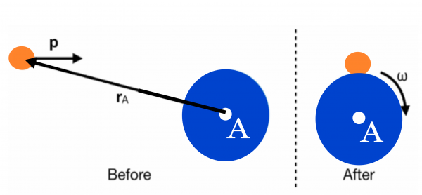
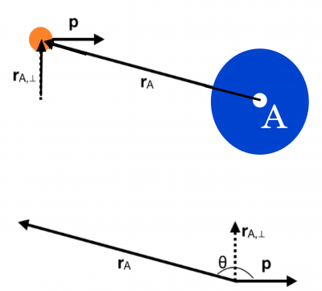
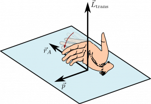
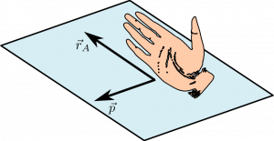

Angular momentum is a way to measure the rotation of a system. As we did with kinetic energy (which is a way to measure the motion of a system), we can separate the angular momentum into translational and rotational bits. **In these notes, you will read about each of these two bits, how they are defined, and how to deal with systems that have both bits.** You will also be introduced to the “into/out of the page” language that we often use in physics to describe the direction of vectors that do not point in the plane.

### Catching a Ball

Earlier, you [read about the situation of a person sitting in a stool that can rotate who catches a thrown ball on the side](/notes/week-12-14-collisions-rotational-motion/angular_motivation/). After that catch, this thrown ball, the person, ball, and stool begin to rotate. You couldn't explain this motion using [conservation of momentum](/notes/week-04-05-springs-contact-interactions/collisions/#momentum_is_never_conserved) and [conservation of energy](https://www.msuperl.org/wikis/pcubed/doku.php?id=183_notes:energy_cons). You needed a new idea: angular momentum. In these notes, you read about the different kinds of angular momentum by considering that demonstration, which is an example of [conservation of angular momentum](/notes/week-12-14-collisions-rotational-motion/l_conservation/).

### Lecture Video



## Translational Angular Momentum

As with [torque](/notes/week-12-14-collisions-rotational-motion/torque/#torque), angular momentum requires that you consider a particular rotation axis. That is, around what point will you determine the angular momentum of the system? *In general any point can be chosen, but the point that is chosen will determine the value of the angular momentum.*

Given that angular momentum is a measure of rotation, you probably have a sense that an object that rotates about itself can have angular momentum, which is true, and will be discussed in a moment. But, an object that is moving, but not rotating about its center can still have angular momentum about a point. In fact, this is how we define angular momentum, in general. To determine the value of this angular momentum requires that we choose a “rotation” axis.

For example, in the [case of the ball-stool experiment](/notes/week-12-14-collisions-rotational-motion/angular_motivation/), a good choice of rotation axis is the axis of the stool. This is because after the person sitting catches the ball, the rotation occurs about the stool axis. Consider the top down view of the experiment.

In this case, after the ball is tossed it is moving with a linear velocity to the right. The force exerted by the ball on the person catching the ball causes a torque on that person and thus they begin to rotate. What you have observed is a transfer of angular momentum. The ball initially had some angular momentum about the stool axis, some of which was transferred to the person and stool.

What is the size and direction of this *translational*[1)](/notes/week-12-14-collisions-rotational-motion/ang_momentum/#fn__1) angular momentum? The angular momentum of an object with momentum $\overset{\rightarrow}{p}$ about a location A is defined by this cross product,

$$
{\overset{\rightarrow}{L}}_{trans} = {\overset{\rightarrow}{r}}_{A} \times \overset{\rightarrow}{p}
$$

where the vector ${\overset{\rightarrow}{r}}_{A}$ is the vector that points from the rotation axis to the object in question. The units of angular momentum are **kilograms-meters squared per second (**$kg\, m^{2}/s$**)**. This is how angular momentum is defined, but it is convenient to think a bit differently about angular momentum associated with an object that rotates about its own center.

### Magnitude of the translational angular momentum

As you [read with torque](/notes/week-12-14-collisions-rotational-motion/torque/#torque), it's often useful to think about how to determine the size of the angular momentum, particularly when all the motion occurs in a plane (e.g., the $x - y$ plane). In that case, the angular momentum vector points in the $z$-direction either + or - (as you will read in a moment).

The magnitude of the angular momentum vector is given by the magnitude of the cross product that defines it,

$$
\left| {\overset{\rightarrow}{L}}_{trans} \right| = \left| {\overset{\rightarrow}{r}}_{A} \times \overset{\rightarrow}{p} \right| = \left| {\overset{\rightarrow}{r}}_{A} \right|\left| \overset{\rightarrow}{p} \right|\sin\theta
$$

where $\theta$ is the angle between the vector ${\overset{\rightarrow}{r}}_{A}$ and $\overset{\rightarrow}{p}$. Another way to think about this magnitude is it is the product of the momentum and the perpendicular “lever arm” that measures how far from the rotation axis the object is.

In the image the right, you can see how that perpendicular distance would be computed. So, you can think of this magnitude as the product of that perpendicular distance and the magnitude of the momentum,

$$
\left| {\overset{\rightarrow}{L}}_{trans} \right| = \left| {\overset{\rightarrow}{r}}_{A} \right|\left| \overset{\rightarrow}{p} \right|\sin\theta = \left| {\overset{\rightarrow}{r}}_{A,\bot} \right|\left| \overset{\rightarrow}{p} \right|
$$

### Direction of the translation angular momentum

 

The angular momentum vector is defined by a cross product, so it's direction is determined by the right hand rule ([as was the direction of torque](/notes/week-12-14-collisions-rotational-motion/torque/#sign_of_the_torque_comes_from_the_right-hand_rule)). In this case, you point your fingers in the direction of the location vector (${\overset{\rightarrow}{r}}_{A}$), and curl your fingers towards the momentum vector. Your thumb indicates the direction of the angular momentum vector. As sample that illustrates this in the plane if shown in the figures to the right.

The position and momentum vectors will always define a plane and the angular momentum vector will always be perpendicular to that plane. This is the nature of cross products. It is typical to talk about the angular momentum vector pointing “out of the page” or “into the page.” This language refers to the direction of angular momentum vector with respect to the plane of a sheet of paper (or computer screen) where the position and momentum vectors would be drawn. In the case where the plane of the page is the $x - y$ plane, “out of the page” is typically the $+ z$ direction while “into the page” is typically the $- z$ direction.

### Lecture Video



### Rotational Angular Momentum

As you [read with rotational kinetic energy](/notes/week-11-multi-particle-energy/rot_ke/), it is often useful to think about the motion of a system about its center. In those notes, you [read about how the translational kinetic energy of atoms in a solid as the move around some central rotation axis](/notes/week-11-multi-particle-energy/rot_ke/#atoms_in_rotating_objects_can_move_with_different_speeds) can be described with rotational kinetic energy. Rotational angular momentum is a similar construct. *It is not that a translating and rotating object has a separate kinds of angular momentum, but that you can mathematically separate the angular momentum due to translation and due to rotation to think about the two parts more easily.*

Consider the spinning ball, person, stool system from the demonstration. In this case, the whole system rotates with the same angular velocity ($\omega$) after the ball was caught. An atom in the ball at a distance of $r_{\bot}$ from the rotation axis is therefore moving with a linear speed $v = r_{\bot}\omega$. Here, $r_{\bot}$ is the perpendicular distance from the rotation axis to the atom in the ball.

From the definition of angular momentum above, you can find the magnitude of the angular momentum of this single atom,

$$
L_{atom} = r_{\bot}p = r_{\bot}\left( m_{atom}v \right) = r_{\bot}\left( m_{atom}r_{\bot}\omega \right)
$$

$$
L_{atom} = m_{atom}r_{\bot}^{2}\omega = I_{atom}\omega
$$

where the last line takes into account the definition of the [moment of inertia](/notes/week-11-multi-particle-energy/rot_ke/) for a point particle at a distance $r_{\bot}$. You can think about adding up all the atoms in the ball, stool, and person, to find the total angular momentum. An atom-by-atom sum would give the rotational angular momentum,

$$
L_{rot} = \sum L_{atom,i} = \sum_{i}^{}m_{atom,i}r_{\bot,i}^{2}\omega = I\omega
$$

where $I$ is the moment of inertia for the whole system because every atom has angular speed $\omega$. The angular momentum vector in this case points into the page because the system rotates clockwise. But where is the vector in the description above? The moment of inertia is a positive scalar, so it must be that the angular velocity is indeed a vector velocity that points in the same direction as the angular momentum.

$$
{\overset{\rightarrow}{L}}_{rot} = I\overset{\rightarrow}{\omega}
$$

The rotational angular momentum is the angular momentum associated with a system rotating about some central axis. This is the situation that you are likely more accustomed to associating with rotation because it looks like the system is actually rotating. This formula above is not the definition of angular momentum, but a convenient form that separates out the angular momentum due rotation about a central axis from the more translational part. But, it stems from the definition of angular momentum as the cross product of the location and momentum vectors.

### Systems with Translational and Rotational Angular Momentum

There will be situations where an object or system is both translating and rotating. In such cases, it's often useful to define discuss these motions separately, [as you did with kinetic energy](/notes/week-11-multi-particle-energy/energy_sep/). In such cases, the total angular momentum of the system is given by the sum of the translational and rotational parts,

$$
{\overset{\rightarrow}{L}}_{tot,A} = {\overset{\rightarrow}{L}}_{trans,A} + {\overset{\rightarrow}{L}}_{rot}
$$

The total angular momentum is defined about a point A, but this location only matters for determining the translational angular momentum. The rotational angular momentum is defined about the rotation axis for each object in the system.

### Examples

- [Angular Momentum of Halley's Comet](/examples/angular_momentum_of_halley_s_comet/)
- [Earth's Translational Angular Momentum](/examples/earth_s_translational_angular_momentum/)
- [Rotational Angular Momentum of a Bicycle Wheel](/examples/rotational_angular_momentum_of_a_bicycle_wheel/)
- [Video Example: Angular Momentum of a woman spinning](/examples/videoswk13/)

------------------------------------------------------------------------

[1)](/notes/week-12-14-collisions-rotational-motion/ang_momentum/#fnt__1)

It is translational because it is due to the translation of the ball (the ball is not rotating about its own center).
