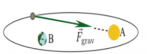

You have read that [torques can cause rotations](/notes/week-12-14-collisions-rotational-motion/torque/), and that [angular momentum is a measure of rotation](/notes/week-12-14-collisions-rotational-motion/ang_momentum/). These two concepts are linked together in the last of 3 fundamental principles of mechanics: the angular momentum principle. **In these notes, you will read about the relationship between the net torque on a system and how its angular momentum changes. You will also read about systems where there is no net torque.**

## Lecture Video



## The Angular Momentum Principle

**The net external torque on a system gives rise to changes in the angular momentum of that system. This relationship is given by the angular momentum principle,**

$$
\frac{\Delta{\overset{\rightarrow}{L}}_{sys}}{\Delta t} = {\overset{\rightarrow}{\tau}}_{ext}
$$

This relationship is quite analogous to the relationship between the net external force and the momentum. In fact, the relationship between the angular momentum and the torque can be [derived from the momentum principle](https://www.msuperl.org/wikis/pcubed/doku.php?id=183_notes:ap_derivation).

The angular momentum principle allows you to predict the new angular momentum of a system given information about its current angular momentum and the torque it experiences in a short time.

$$
{\overset{\rightarrow}{L}}_{sys,f} = {\overset{\rightarrow}{L}}_{sys,i} + {\overset{\rightarrow}{\tau}}_{ext}\Delta t
$$

If the system is continuously changing, then you can take the limit that $\Delta t$ goes to zero as you have done in the past with momentum to find the derivative form of the angular momentum principle and how to integrate it to find the future angular momentum.

$$
\frac{d{\overset{\rightarrow}{L}}_{sys}}{dt} = {\overset{\rightarrow}{\tau}}_{ext}
$$

$$
{\overset{\rightarrow}{L}}_{sys,f} - {\overset{\rightarrow}{L}}_{sys,i} = \int_{i}^{f}{\overset{\rightarrow}{\tau}}_{ext}dt
$$

## Systems That Experience No Net Torque

Comet orbiting two locations. Location A being a star, and Location B being Earth. Identifying areas of interest in relation to net torque.

For some systems, you might be able to choose a location from which to measure the angular momentum where the system experiences no net torque. For example, in the figure to the right a comet orbits a star. The gravitational force vector points from the comet to the star (red arrow).

If you choose the location about which to determine the angular momentum to be the star itself (i.e., location A), then the comet experiences no net torque. Why? Because the position vector that locates the comet points from the star to the comet and is thus along the same line as the gravitational force. The cross product of two parallel or anti-parallel vectors is zero. *Hence, the angular momentum of the comet around the star is constant. That constant is not zero; the torque is zero.*

$$
\Delta{\overset{\rightarrow}{L}}_{sys} = 0 \rightarrow {\overset{\rightarrow}{L}}_{sys,f} = {\overset{\rightarrow}{L}}_{sys,i}
$$

If instead you chose a different location (e.g., location B in the figure to the right), there is a net torque about that point because the force vector and the position vector are no longer anti-parallel. So, making an informed choice for the location about which to determine the angular momentum might result in a simpler problem to address because you can leverage [conservation of angular momentum](/notes/week-12-14-collisions-rotational-motion/l_conservation/).

## Examples

- [A Meter Stick on the Ice](/pcubed/examples/a_meter_stick_on_the_ice/)
