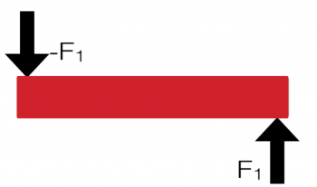

While you are beginning to learn about [how objects rotate](/notes/week-12-14-collisions-rotational-motion/torque/), it's worth taking an aside to discuss how objects remain still. You have already begun this work, when you read about [Free Body Diagrams](/notes/week-04-05-springs-contact-interactions/freebodydiagrams/) and worked with [Young's Modulus](/notes/week-06-solids-curved-motion/youngs_modulus/). In both those cases, you read that an object at rest will remain at rest ([it won't change its momentum](/notes/week-02-modeling-motion-net-force/momentum_principle/)) as long as the net force acting on the object is zero. It turns out that isn't the complete story. **In these notes, you will read about static equilibrium, how the concept of torque plays a key role in defining static equilibrium, and how we analyze static equilibrium situations.**

## Defining Static Equilibrium

**We define a system to be in static equilibrium if it is not moving**. That seems obvious, but there are two specific conditions on the motion that has to be satisfied:

1.  The system cannot be translating (moving up/down, left/right, etc.).
2.  The system cannot be rotating (clockwise or counter-clockwise).

The first of these conditions [you have dealt with previously](/notes/week-04-05-springs-contact-interactions/freebodydiagrams/) when we discussed Free Body Diagrams. The first condition implies that the net force on the system must be zero:

$$
{\overset{\rightarrow}{F}}_{net} = {\overset{\rightarrow}{F}}_{1} + {\overset{\rightarrow}{F}}_{2} + {\overset{\rightarrow}{F}}_{3} + \cdots = 0
$$

So if we analyze all the forces in each coordinate direction, they must sum to zero, for example,

$$
\sum F_{x} = 0\quad\quad\sum F_{y} = 0
$$

*If the sum of all the forces is zero then static equilibrium is possible but **not** guaranteed.*

A bar with two identically sized forces acting on it.

### Why Torque Matters

Consider the simple system of the bar to the right. Two equal-sized forces are acting on the bar in opposite directions. In this case, the sum of the forces in each coordinate direction (namely, the vertical direction) is zero. Hence, this situation satisfies the first condition for static equilibrium. However, you can probably easily see that with these forces applied, the bar will rotate (counter-clockwise). So, in this case, we violate condition 2 above and the bar is not in static equilibrium (because it is going to rotate).

The forces apply [torques](/notes/week-12-14-collisions-rotational-motion/torque/) to the bar *if we consider the center of the bar to be the rotation point.* In that case, both torques point out of the page ([Torque directions are defined by the right-hand rule](/notes/week-12-14-collisions-rotational-motion/torque/)) and are (roughly) the same size (as long as they are the same distance from the center). Remember that to calculate a torque, you need to choose a location about which you will consider rotation (more on this later).

So, to have a static equilibrium situation it must be that we have both:

1.  The sum of all the forces in each coordinate direction, the net force, is zero (no translation)
2.  The sum of all the torques around all rotation points, the net torque at a rotation point, is zero (no rotation about any point)

The second of these conditions in conceptually different than we have dealt with before because you might have to consider multiple rotation locations (not just the obvious ones). To satisfy the second condition, we must have:

$$
{\overset{\rightarrow}{\tau}}_{net,A} = {\overset{\rightarrow}{\tau}}_{1,A} + {\overset{\rightarrow}{\tau}}_{2,A} + {\overset{\rightarrow}{\tau}}_{3,A} + \cdots = 0
$$

for any location A about which you calculate the torque. This is the challenging part of the static equilibrium concept: about what point should the torque be considered? There is no general rule, but if you find a point where the net torque is non-zero the system is not in static equilibrium.

However, we often observe that a system is not translating or rotating and thus we can apply the static equilibrium conditions to understand what forces are being applied and at what locations (rather than the inverse problem of figuring out if a particular system is in static equilibrium).

You can use an [extended free-body diagram](/notes/week-12-14-collisions-rotational-motion/torquediagram/), termed the “torque diagram”, to investigate situations of static equilibrium. You should also review [free-body diagrams](/notes/week-04-05-springs-contact-interactions/freebodydiagrams/) if you are bit rusty with them.

## Examples

- [Static Equlibrium](https://www.msuperl.org/wikis/pcubed/doku.php?id=183_notes:examples:statics)
