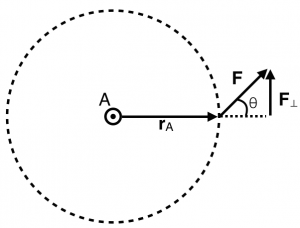
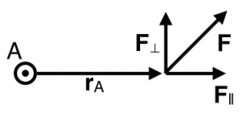
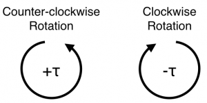

Until now, you have worked with [forces](/notes/week-04-05-springs-contact-interactions/mp_multi/) and [work](/notes/week-07-energy-transfer/work/) to explain and predict the motion of objects. You've even used [work and energy to begin to explain that objects can rotate](/notes/week-11-multi-particle-energy/rot_ke/), but you haven't yet unpacked how that occurs – only that a system can share energy between translation and rotation. **In these notes, you will read about torque, which is a force applied at a distance from a specific point that causes a twisting or rotating about that point.**

### Lecture Video



## Torque

**Torque is a vector quantity that describes how you can change the rotation of an object.**. Specifically, the torque about a point A is the vector (cross) product of the vector that points from A to the point where the force is applied and the force itself. That's a mouthful, but you can think about it in terms of the figure to the right.

Consider a bolt that is located at A in the figure to the right. You attach a wrench to location A and push on the end of the wrench with the force indicated. The vector that points from A to the end of the wrench where the force is applied is ${\overset{\rightarrow}{r}}_{A}$. This distance is often called the “lever arm.” It indicates the point of application of the force relative to the rotation axis.

In this situation, the force that you apply to the end of the wrench is not “100% effective” because only the component of the force applied perpendicular to the lever arm contributes to the rotation of the bolt. In any event, the bolt will rotate in a counter-clockwise manner as the end of the wrench moves around the dotted circle. The torque that is applied is related to the lever arm and the applied force by the cross product.

$$
{\overset{\rightarrow}{\tau}}_{A} = {\overset{\rightarrow}{r}}_{A} \times \overset{\rightarrow}{F}
$$

The **torque is a vector**; it has both a magnitude and direction. **The units of torque are Newton-meters (**$Nm$**)**. This is the first physical quantity that you have seen that depends on the cross (vector) product between two vectors. It's worth taking some time to understand how this mathematics works.

### The Magnitude of the Torque

**The magnitude of the torque depends on the component of the force that is perpendicular to the lever arm**. In the figure above, the perpendicular component of the force is given by,

$$
F_{\bot} = F\sin\theta
$$

So that the magnitude of the torque around location A is given by,

$$
\left| {\overset{\rightarrow}{\tau}}_{A} \right| = \left| {\overset{\rightarrow}{r}}_{A} \times \overset{\rightarrow}{F} \right| = r_{A}F\sin\theta
$$

This mathematical relationship holds for any cross product. The magnitude of a general cross product is the product of the magnitudes of the vectors multiplied by the sine of the angle between them.

$$
\left| \overset{\rightarrow}{B} \times \overset{\rightarrow}{C} \right| = \left| \overset{\rightarrow}{B} \right|\left| \overset{\rightarrow}{C} \right|\sin\theta_{BC}
$$

So, as shown in the figure to the right, the torque is only due to the component of the force that is perpendicular to the lever arm ($F_{\bot}$).

### The Direction of the Torque

Torque is a vector quantity; it has a direction. How can you determine that direction?

In general, this is done mathematically by [taking the determinant of a special matrix](https://www.msuperl.org/wikis/pcubed/doku.php?id=183_notes:cross_product), which you might have seen in other mathematics courses. For most purposes, you will consider motion in the plane (e.g., $x - y$ plane). This is a bit easier to think about than cross products in general [1)](/notes/week-12-14-collisions-rotational-motion/torque/#fn__1). If the lever arm (${\overset{\rightarrow}{r}}_{A}$) and the applied force ($\overset{\rightarrow}{F}$) live in the $x - y$ plane, the torque points in the $z$-direction (either + or -).

Here's the proof of that. Consider a lever arm in the $x - y$ plane that locates a force with respect to some rotation axis: ${\overset{\rightarrow}{r}}_{A} = \langle r_{x},r_{y},0\rangle$ and a force that similar lives in the $x - y$ plane: $\overset{\rightarrow}{F} = \langle F_{x},F_{y},0\rangle$. You want to take the cross product to find the torque:

$$
{\overset{\rightarrow}{\tau}}_{A} = {\overset{\rightarrow}{r}}_{A} \times \overset{\rightarrow}{F} = det\left| \begin{matrix}
\widehat{x} & \widehat{y} & \widehat{z} \\
r_{x} & r_{y} & 0 \\
F_{x} & F_{y} & 0
\end{matrix} \right|
$$

Taking the cross product [as described in these notes](https://www.msuperl.org/wikis/pcubed/doku.php?id=183_notes:cross_product):

$$
{\overset{\rightarrow}{\tau}}_{A} = \left( r_{y}(0) - 0(F_{y}) \right)\widehat{x} - \left( r_{x}(0) - 0(F_{x}) \right)\widehat{y} + \left( r_{x}F_{y} - r_{y}F_{x} \right)\widehat{z} = \left( r_{x}F_{y} - r_{y}F_{x} \right)\widehat{z}
$$

$$
{\overset{\rightarrow}{\tau}}_{A} = \langle 0,0,r_{x}F_{y} - r_{y}F_{x}\rangle
$$

Notice that if the applied force and the lever arm point in the same (or precisely opposite directions) the torque is zero. The cross product of two parallel or anti-parallel vectors is zero.

### Sign of the Torque comes from the Right-Hand Rule

When working with forces and lever arms that exist is a plane (e.g., $x - y$ plane), *the torque always points in the* $z$*-direction.* So, it becomes useful to think about the torque as having a sign, either + or - depending on whether in points in the $+ z$ or $- z$ direction. The “right-hand rule” is helpful to think about this.

To use this rule, point your fingers in the direction of the the lever arm (from the rotation point to the point of application of the of the force). Then, curl your fingers in the direction of the force. Your thumb will point in the direction of the torque. This works for any situation, but you might be confused about the sign. A simpler way of remembering it is using the picture on the right. This is somewhat analogous to having forces in different directions.

**The language often used to describe the torque direction is into the page and out of the page.** It is the nature of cross products that the resultant is perpendicular to the plane defined by the vectors in the cross product. So, if the lever arm and the force vector appear on page (or screen), the torque will point into or out of the page (or screen). In the cases shown to the right, it means the vector associated with the torque points into the screen (negative, clockwise rotation) or out of the screen (positive, counter-clockwise rotation).

### The Net Torque Causes Changes in Rotation

Just like you read for forces, there can be multiple torques applied to an object. That is, there might be forces applied at different locations and in different directions, which could (on their own) give rise to different rotations. The concept of a net torque is an important one because it helps you decide what the rotation will be (or even if there will be any rotation). The net torque is the vector sum of all the torques acting on an object. These torques must be computed around the same rotation axis (i.e., the lever arm for each force can be different, but this lever arm must be measured from the same rotation location).

$$
{\overset{\rightarrow}{\tau}}_{net} = \sum_{i}^{}{\overset{\rightarrow}{\tau}}_{i}
$$

The sign of each torque is incredibly important for determining the net torque. It is the net torque that causes changes in rotation, just like it is the [net force that causes changes in translation](/notes/week-02-modeling-motion-net-force/momentum_principle/).

### Examples

- [Video Example: Torque on a wrench](/pcubed/examples/videoswk12/)
