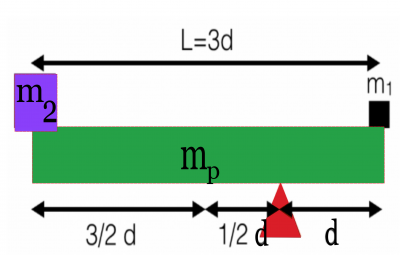
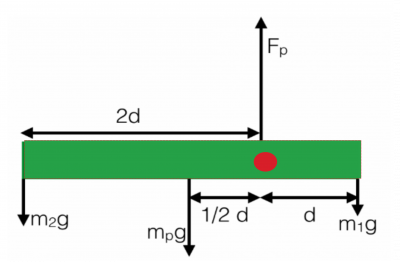

To investigate situations in static equilibrium more thoroughly, you can make use of an extended free-body diagram that shows the “point of application” of the force. That is, you won't crush the system down to a [point particle](/notes/week-07-energy-transfer/point_particle/) and [treat all the forces as acting at the center of mass](/notes/week-04-05-springs-contact-interactions/freebodydiagrams/). Instead, you will consider where the forces are applied because doing so will be necessary for determining [the torque](/notes/week-12-14-collisions-rotational-motion/torque/) (or, rather, exploiting the fact that the sum of all the torques about any rotation point is zero).

**In these notes, you will read through an example where we will apply the ideas that the net force and net torque are zero and make use of the torque diagram to construct a mathematical representation of the problem.**

## A Balanced Situation

Consider the situation in the figure below. A uniform plank of mass $m_{p}$ and length $3d$ is placed on a pivot as shown below. A mass $m_{2}$ is placed on the far left edge of the plank. To balance the whole setup, you want to place a mass $m_{1}$ on the far right edge. You need to figure out how large $m_{1}$ should be compared to the other masses in the setup to determine what mass to place on the far left edge (As shown).

*Because you are designing for no motion, you want the entire system to be in static equilibrium.* We can do a typical force analysis to see if this yields anything helpful, but first, let's draw the extended free-body diagram – the torque diagram. Below, you will see a diagram that labels the four forces acting on the system: the gravitational force on each of the three objects, which points downward, and the force due to the pivot, which points upward. In addition, a torque diagram labels all the lever arm distances (given a specific choice of the pivot point, red dot in this case).

Notice the forces are positioned at the location where they act. For each of the three objects, we treat the gravitational force as acting at the center of masses (in this case at their centers because they are of uniform density). For objects of non-uniform density, [the situation would be a bit different](https://en.wikipedia.org/wiki/Center_of_mass). The pivot force acts at the point of contact (i.e., where the pivot touches the plank). This diagram will help us determine how the torques will play out.

### An Analysis of the Forces

In this case, you know you want the system to be in static equilibrium, so you can add all the forces up in the respective directions (knowing the net force must be zero) to see if this helps you find $m_{1}$ (given you know $m_{2}$ and $m_{p}$).

$$
{\overset{\rightarrow}{F}}_{net} = 0 \rightarrow F_{net,x} = 0\mspace{6mu} and\mspace{6mu} F_{net,y} = 0
$$

In this case, there are no forces in the x-direction, so the condition on the first coordinate direction is automatically satisfied. But in the y-direction,

$$
F_{net,y} = \sum F_{y,i} = F_{p} - m_{p}g - m_{2}g - m_{1}g = 0
$$

You don't know either the mass $m_{1}$ nor the force due to the pivot, so this equation cannot be solved (you have two unknowns, but only one equation!). However, you should anticipate that you can find $m_{1}$ by some other means, so let's solve instead for the pivot force,

$$
F_{p} = m_{p}g + m_{2}g + m_{1}g
$$

This makes sense! The pivot force must be large enough to support the weight of all the objects. Once you find $m_{1}$, you can determine the size of the pivot force.

#### An analysis of the torques

In the above torque diagram, a pivot point has already been chosen (red dot). This means there's an infinite number of torque diagrams you can draw! How do you choose the “right” one? There's no rule for this, but you may want to look at a few pivot points before committing to one. For example, in this case, there's 4 reasonable choices: (1) the left end of the plank, (2) the right end of the plank, (3) the center of the plank, and (4) the pivot location.

Why did location 4 get picked in this case?

- **Problem with Location 1 (Left end of plank)** The left end of the plank is a reasonable choice. Because all the torques about that location have to be zero, we can use the torques due to the weight of the plank, the pivot force, and the weight of mass 1 to do the analysis. The problem is that we neither know mass 1 or the pivot force, so we are again left with two unknowns and one equation. We could solve the system of equations resulting from the force analysis above and use that here, but the math could be a little hairy. You will probably have to do that in the future at some point.
- **Problem with Location 2 (Right end of plank)** The right end of the plank is also reasonable. Again, all the torques have to be zero about that location. Now, these torques are due to the weight of the plank, the pivot force, and the weight of mass 2. Notice that when you pick a point of application of a force to be the pivot point (e.g., the location where mass 1 is) that force no longer contributes because there's no lever arm. However, this removes mass 1 from the analysis all together – still OK because we could again solve the system of equations resulting from this analysis and the force analysis above.
- **Problem with Location 3 (Center of plank)** At the center of the plank, the torques are due to the weight of the two masses and the pivot force. So we have a similar situation to location 1, we don't know mass 1 or the pivot force - so we will have to solve a system of equations.

##### Let's use Location 4 (Pivot location)

In this case, the pivot force is not included in the analysis and the only unknown is mass 1. We can perform a torque analysis around this location noticing that the weight of the plank and mass 1 will contribute to an out-of-the-page torque (positive torque) while mass 2 will contribute to an into-the-page torque (negative torque). [Torque directions are defined by the right-hand rule](/notes/week-12-14-collisions-rotational-motion/torque/). Our analysis of the net torque gives,

$$
{\overset{\rightarrow}{\tau}}_{net} = 0 \rightarrow \tau_{net,z} = 0
$$

$$
\tau_{net,z} = \sum\tau_{z,i} = + 2d(m_{2}g) + \frac{d}{2}(m_{p}g) - d(m_{1}g) = 0
$$

We do a little algebra on this equation, solving for $m_{2}$:

$$
d(m_{1}g) = 2d(m_{2}g) + \frac{d}{2}(m_{p}g)
$$

$$
dm_{1} = 2dm_{2} + \frac{d}{2}m_{p}
$$

$$
m_{1} = 2m_{2} + \frac{m_{p}}{2}
$$

Here, you obtain $m_{1}$ without any additional work. So, to summarize, every pivot location can be used – it's just that some make the work a little easier than others. You would not have been wrong to choose any of the other locations.

## Examples

- [Calculating Static Torque](https://www.msuperl.org/wikis/pcubed/doku.php?id=183_notes:examples:statictorque)
